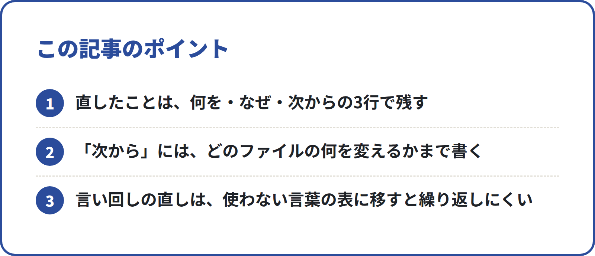
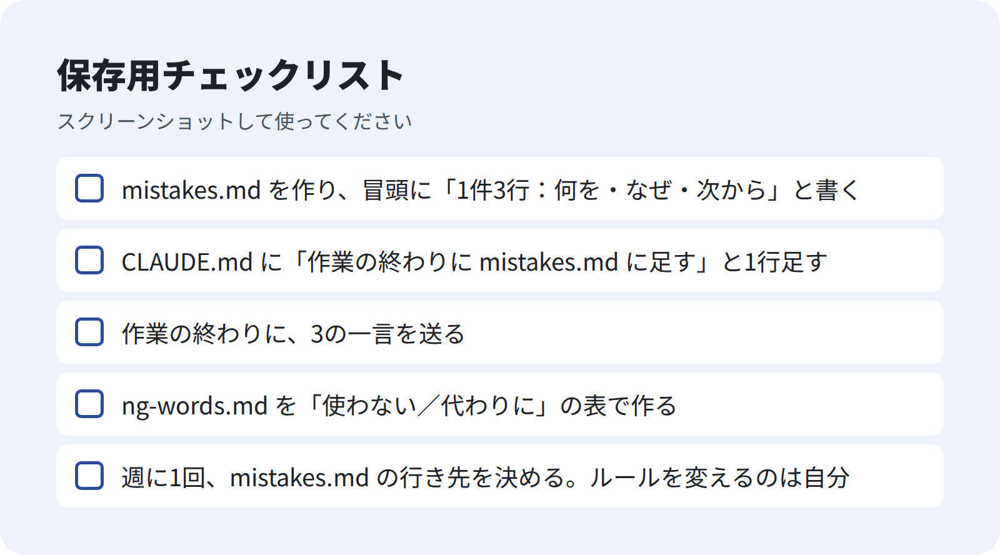

<!-- 状態：校正待ち（ライター：ユキ・9/30）／アカウント：A01／価格：980円
     編集長へ：【社長確認】は1か所（実際に書かれた mistakes.md の1件）だけ。確認できない場合はその段落ごと消す。
     本文の3行の例は、このリポジトリの mistakes.md にある「記入例」と、説明用に作った記入例。実際に起きた失敗としては書いていない。
     末尾の「別の記事」は N002。N002 を公開したらリンクに差し替える -->

# mistakes.md で AI の失敗を資産にする運用ルール

**こんな人向け：** AI を仕事に使っていて、「前にも直したのに、また同じ間違いをする」と感じている人。

**この記事でできること：** AI に直させたことを、3行のメモで残す仕組みを作れます。メモを点検表や「使わない言葉」の表に移して、同じ失敗を減らしていく流れまでわかります。

**筆者がやったこと：** 自社の営業チームと note の編集チームを、Claude Code（AI に作業をさせる道具）で動かしています。どちらのチームにも `mistakes.md` というファイルを置き、作業の終わりに AI 自身に書かせる約束にしています。

**この記事について：** 2026年9月に書きました。Claude Code の機能名・画面は変わりやすいので、使う前に公式の最新情報を確認してください。

---

## 直しても、次の回でまた同じ間違いをする

AI に仕事を頼んで、出てきたものを直す。ここまでは多くの人がやっています。

困るのは、次の回です。AI は、前の会話で直されたことを覚えているとは限りません。新しい作業を始めると、また同じところで間違えることがあります。

直すたびに口で言うのは、人の新人に毎日同じ注意をするのと同じです。**注意をメモにして、毎回読ませる**ほうが楽です。

## 結論：3行で残して、あとで行き先を決める

仕組みは4つだけです。

1. **3行で書く**：何を・なぜ・次から
2. **作業の終わりに、AI に書かせる**：一言頼むだけ
3. **言い回しの直しは ng-words.md に移す**：使わない言葉の表にする
4. **週に1回、見直す**：たまったメモを、点検表やルールに移す

失敗を「なかったこと」にせず、次の仕事で使えるルールに変えます。これが「資産にする」の意味です。

<!-- 画像：ポイント -->


**無料部分のまとめ（ここだけでも使えます）**
- 直したことは、何を・なぜ・次からの3行で残す
- 「次から」には、どのファイルの何を変えるかまで書く
- 言い回しの直しは、使わない言葉の表に移すと繰り返しにくい

### 有料部分の目次
1. mistakes.md の作り方（実物の冒頭）
2. 3行の書き方：よい例と、よくない例
3. 作業の終わりに送る一言（コピー用）
4. 言い回しの直しを ng-words.md に移す
5. 週に1回の見直しの手順と、頼み方
6. 例：営業文・記事・資料
7. つまずきやすい点と、直し方
8. 明日から始めるチェックリスト

--- ここから有料 ---

## 1. mistakes.md の作り方

仕事のフォルダに `mistakes.md` を1つ置きます。このチームで使っている冒頭は、次の3行です。

```
# mistakes.md（直させたこと）

作業の終わりに Claude が書く。1件3行：何を・なぜ・次からどうするか。
言い回しの直しは ng-words.md へ移す。
```

そして、毎回読む約束ごとのファイル（`CLAUDE.md`）に1行足します。このチームの CLAUDE.md では、こう書いています。

```
- 作業の終わりに、社長に直された点を その部の mistakes.md に足す（何を・なぜ・次からどうするか の3行）
```

Claude Code は、作業フォルダの `CLAUDE.md` をセッション（作業のひと区切り）を始めるたびに読みます。この1行があれば、頼み忘れても書く約束が残ります。

正直に書くと、このチームの mistakes.md は、まだ記入例から始めたところです。

【社長確認：実際に mistakes.md に書かれた1件を、社名・個人名を消して載せる（書けなければこの段落ごと消す）】

## 2. 3行の書き方

形はこれだけです。

```
何を：（どんな間違いをしたか）
なぜ：（どうして起きたか）
次から：（どのファイルの、何を変えるか）
```

### よい例（このチームの mistakes.md の記入例）

営業文の担当向け：
```
何を：フォームの下に「営業のご連絡はご遠慮ください」とあった店に下書きを作った
なぜ：フォームのページの下まで読まなかった
次から：review.md の1行目を、フォームのページ全体で確かめる
```

note の記事の担当向け：
```
何を：確認していない売上の数字を原稿に書いた
なぜ：knowledge.md にない数字を推測で埋めた
次から：数字がないときは【社長確認：〇〇】と書いて空ける
```

どちらも「次から」に、**何をどう変えるか**が書いてあります。ここが一番大事です。

### よくない例
```
何を：間違えた
なぜ：不注意
次から：気をつける
```

「気をつける」は、次の回に何をすればいいのか決まりません。AI も人も同じです。「次から」は、**点検表の1行・約束ごとの1行・言葉の表の1行**のどれかに落とせる形で書きます。

## 3. 作業の終わりに送る一言

作業が終わったら、これを送ります。

```
今回私が直したところを mistakes.md に足して。
1件3行で、何を・なぜ・次からどうするか。
「次から」には、どのファイルの何を変えるかまで書いて。
言い回しだけの直しは、ng-words.md に移す候補として印をつけて。
```

直したところがない日は、書かなくてかまいません。**無理に書くと、中身のないメモが増えます。**

## 4. 言い回しの直しを ng-words.md に移す

直しには2種類あります。

- **やり方の直し**：確かめ忘れ・手順の抜け → `review.md`（出す前の点検表）に1行足す
- **言い回しの直し**：使ってはいけない言葉 → `ng-words.md` に移す

言い回しは、表にしておくと繰り返しにくくなります。このチームの営業用 ng-words.md は、次の形です（抜粋）。

```
| 使わない | 代わりに |
|---|---|
| 絶対儲かります／必ず来店が増えます | 「Googleマップからの来店を増やす方法の1つとしてご案内しています」 |
| 今だけ／本日中に | （期限がある場合は事実だけを伝える） |
| 「1位にします」「上位表示を保証」 | 順位は Google が決める。保証はできない |
```

ポイントは**「代わりに」の列**です。「使うな」だけだと、AI は別の似た言葉を探します。代わりの言い方があると、そちらを使ってくれやすくなります。

このチームでは、移す作業をマーケ担当の役割に入れています。指示書（`.claude/agents/marketer.md`）には、こう書いています。

```
4. sales/mistakes.md の中の言い回しの直しを sales/ng-words.md に移す
```

Claude Code では、`.claude/agents/` に役割ごとの指示書を置けます（サブエージェントと呼びます）。指示書がなくても、下の見直しのときに自分で頼めば同じことができます。

## 5. 週に1回の見直し

mistakes.md は、書くだけだとたまっていくだけです。週に1回、行き先を決めます。

### 手順
1. mistakes.md を上から読む
2. 同じ失敗が2回以上あるものを探す
3. 行き先を決める
   - 手順の抜け → `review.md` に1行足す
   - 言い回し → `ng-words.md` に移す
   - 毎回守るべきこと → `CLAUDE.md` に1行足す（5行を超えそうなら review.md へ）
4. 移したメモの頭に「済：review.md へ」と書く

### 頼み方（コピー用）
```
mistakes.md を読んで、次の3つに分けて。
・review.md に足す点検項目の案
・ng-words.md に移す言い回しの案（使わない／代わりに）
・CLAUDE.md に足すルールの案
案を見せてから、私が OK したものだけファイルに書いて。
```

最後の1行が大事です。**ルールを変えるのは人が決めます。** AI に任せると、点検表がどんどん長くなりがちです。

このチームの営業用 review.md にも、別の担当から「嫌われない営業の点検（案）」として4項目が提案されています。足すかどうかは、点検役（SV）が決める形です。

## 6. 例：営業文・記事・資料

説明用の記入例です。自分の仕事に置き換えて使ってください。

### 営業文
```
何を：1通目のメールに料金表を貼った
なぜ：「1通目の目的は日程だけ」と書いていなかった
次から：CLAUDE.md に「1通目の目的は15分の説明の日程だけ」と足す
```

### 記事・ブログ
```
何を：他の人のブログの文を、ほぼそのまま使った
なぜ：引用のルールを渡していなかった
次から：review.md に「引用には出典がある。そのまま使うのは必要な範囲だけ」と足す
```

### 社内資料
```
何を：表の数字と本文の数字が合っていなかった
なぜ：本文を書いたあとに、表を直した
次から：review.md に「本文の数字が表と一致している」と足す

<!-- 画像：チェックリスト -->


```

## 7. つまずきやすい点と、直し方

| つまずき | 原因 | 直し方 |
|---|---|---|
| 同じ失敗が何度も書かれる | 書くだけで、行き先に移していない | 週1回の見直しで review.md か ng-words.md に移す |
| 「気をつける」ばかりになる | 「次から」の書き方を決めていない | 「どのファイルの何を変えるか」まで書くと頼む |
| 点検表が長くなりすぎる | 思いつきで足している | 2回以上起きたものだけ足す。足すのは人が決める |
| mistakes.md が書かれない | 頼み忘れ | CLAUDE.md に「作業の終わりに書く」と1行入れる |

## 8. 明日から始めるチェックリスト

- [ ] mistakes.md を作り、冒頭に「1件3行：何を・なぜ・次から」と書く
- [ ] CLAUDE.md に「作業の終わりに mistakes.md に足す」と1行足す
- [ ] 作業の終わりに、3の一言を送る
- [ ] ng-words.md を「使わない／代わりに」の表で作る
- [ ] 週に1回、mistakes.md の行き先を決める。ルールを変えるのは自分

CLAUDE.md と review.md の始め方は、別の記事で書く予定です。

---

質問はコメントでどうぞ。
