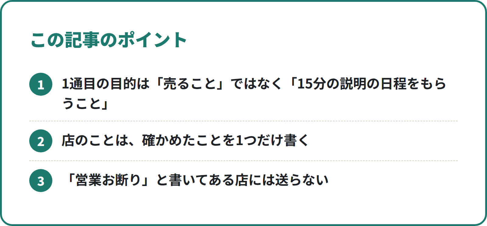
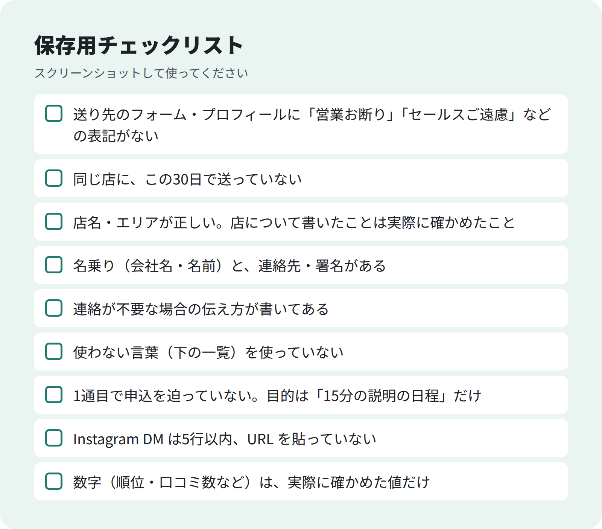

<!-- 状態：校正待ち（ライター：タロ）／アカウント：A02／価格：2,980円
     編集長へ：返信率などの実数は営業部の結果が出てから入れる。【社長確認】が残っている間は公開しない
     10/1 タロ：本文の【社長確認】を整理 -->

# 問い合わせフォーム営業で返信をもらう文面の型と点検リスト

**こんな人向け：** 店舗や中小企業に、問い合わせフォームや Instagram の DM で営業している人。送っても返信が来ない、そもそも送ってよいのか不安な人。

**この記事でできること：** 返信をもらうための6行の文面の型と、送る前に確かめる9項目の点検リストが手に入ります。AI に文面を書かせるときの指示の出し方も載せています。

**筆者がやったこと：** MEO対策ツールの営業で、フォームと DM だけでアポを取る仕組みを作りました。文面は AI が作り、点検係の AI が確かめ、送信は人が行っています。【社長確認：営業部の実数（送信数・返信数・アポ数）】

---

## 返信が来ない文面には、共通点があります

- 長い。スマホで1画面に収まらない
- どの店にも同じことを書いている
- 何をしてほしいのかが最後まで分からない
- 断り方が書いていないので、無視するしかない

相手は忙しい店長やオーナーです。**読む前に「これは自分あてか」「何をすればいいか」が分からない文面は、読まれません。**

## 結論：6行で書き、送る前に9項目を確かめる

1. 名乗り（会社名・名前）
2. なぜこの店に送ったか（1つだけ具体的に）
3. お願いしたいこと（「15分だけ」など小さく）
4. 日程を2つ出す
5. 連絡が不要な場合の伝え方
6. 署名

有料部分では、この6行の実例（フォーム用・DM 用）、点検リスト9項目、AI への指示文をそのまま載せています。

<!-- 画像：ポイント -->


**無料部分のまとめ（ここだけでも使えます）**
- 1通目の目的は「売ること」ではなく「15分の説明の日程をもらうこと」
- 店のことは、確かめたことを1つだけ書く
- 「営業お断り」と書いてある店には送らない

### 有料部分の目次
1. フォーム用・DM 用の文面の実例
2. 送る前の点検リスト9項目
3. 使わない言葉の一覧（代わりに使う言葉つき）
4. AI に文面を書かせる指示文（コピーして使える）
5. 送ってよいかの判断（法律・規約で気をつけること）
6. 返信が来たあとの返し方

--- ここから有料 ---

## 1. 文面の実例

### フォーム用
```
件名：{店名}様　Googleマップでの見つけられ方について（15分）

はじめまして。{会社名}の{名前}です。
「{エリア} {業種}」で Googleマップを検索したとき、{店名}さんの口コミを拝見してご連絡しました。
Googleマップからのご来店を増やすためのツールを、15分だけオンラインでお見せできないでしょうか。
10/2（木）14時か、10/3（金）11時はいかがでしょうか。
今後のご連絡が不要でしたら、「不要」とだけご返信ください。以後お送りしません。

{会社名}　{名前}　{電話}　{メール}
```

### Instagram DM 用（5行以内・URL は貼らない）
```
はじめまして、{会社名}の{名前}です。
{店名}さんの{メニュー}の投稿を拝見してご連絡しました。
Googleマップからのご来店を増やすツールを、15分だけご紹介させていただけないでしょうか。
ご興味がなければ、このままスルーしていただいて大丈夫です。
```

**ポイント**
- 2行目の「なぜこの店に」は、実際に見たことだけを書く。見ていない順位や数字は書かない
- 日程は2択にする。「ご都合のよい日時を教えてください」より返事がしやすい
- 断り方を書くと、相手は安心して読める

## 2. 送る前の点検リスト9項目

<!-- 画像：チェックリスト -->


```
- [ ] 送り先のフォーム・プロフィールに「営業お断り」「セールスご遠慮」などの表記がない
- [ ] 同じ店に、この30日で送っていない
- [ ] 店名・エリアが正しい。店について書いたことは実際に確かめたこと
- [ ] 名乗り（会社名・名前）と、連絡先・署名がある
- [ ] 連絡が不要な場合の伝え方が書いてある
- [ ] 使わない言葉（下の一覧）を使っていない
- [ ] 1通目で申込を迫っていない。目的は「15分の説明の日程」だけ
- [ ] Instagram DM は5行以内、URL を貼っていない
- [ ] 数字（順位・口コミ数など）は、実際に確かめた値だけ
```

私たちは、この点検を文面を作る AI とは別の AI（SV 役）にやらせています。**作る役と点検する役を分ける**と、見落としが減ります。

## 3. 使わない言葉の一覧

| 使わない | 代わりに |
|---|---|
| 必ず来店が増えます | Googleマップからの来店を増やす方法の1つとしてご案内しています |
| 1位にします・上位表示を保証 | （順位は Google が決めるので、保証しない） |
| 口コミを増やします | （見返りつきの口コミ集めは Google のポリシー違反を連想させるので使わない） |
| 至急ご返信ください | （返信は相手の自由。使わない） |
| 今だけ・本日中に | 期限が事実のときだけ、事実を書く |

## 4. AI に文面を書かせる指示文

```
あなたは店舗向けの営業担当です。次の店に送る問い合わせフォームの文面を作ってください。
- 6行で：名乗り／この店に送った理由（下の事実から1つ）／15分の説明のお願い／日程2択／不要な場合の伝え方／署名
- 店について書くのは、下の「確かめた事実」だけ。ないことは書かない
- 使わない言葉：必ず・保証・1位・口コミを増やします・至急・今だけ
- 書いたあと、次の点検リストを全部確かめて、引っかかったら直してから出す
（点検リスト9項目を貼る）

店名：
業種・エリア：
確かめた事実：（例：Googleの口コミ12件、ランチの写真が多い）
日程候補：
```

## 5. 送ってよいかの判断

- **問い合わせフォーム**：「営業お断り」の表記がある店には送らない。表記がなくても、同じ店に何度も送らない
- **メール**：特定電子メール法では、原則として相手の同意が必要です。事業者がネットで公表しているアドレスは例外になりえますが、「広告メールお断り」などの表示があれば送れません（[総務省ガイドライン](https://www.soumu.go.jp/main_content/000060967.pdf)）。私たちはメールでの営業はしていません
- **Instagram DM**：公式の仕組みでは、相手から先に連絡がないと DM を送れません。非公式ツールでの自動送信は規約違反になりえます。私たちは人が1件ずつ送っています

※法律の判断は、必要に応じて専門家に確認してください。

## 6. 返信が来たあとの返し方

- **興味あり** → 日程を2択で返す。その日のうちに返す
- **検討中** → 資料は1枚だけ送り、「1週間後にもう一度ご連絡してもよいですか」と聞く
- **お断り** → お礼だけ返して、以後送らない

---

質問はコメントでどうぞ。
