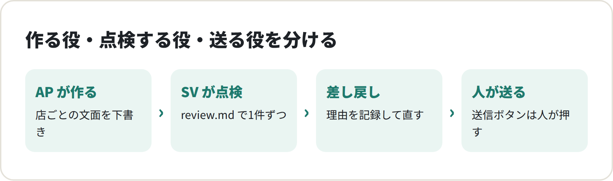
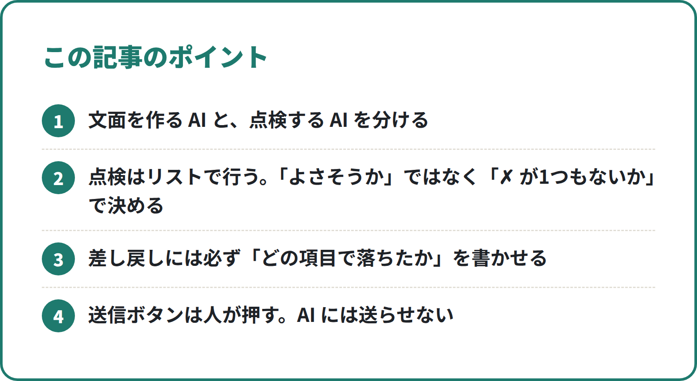
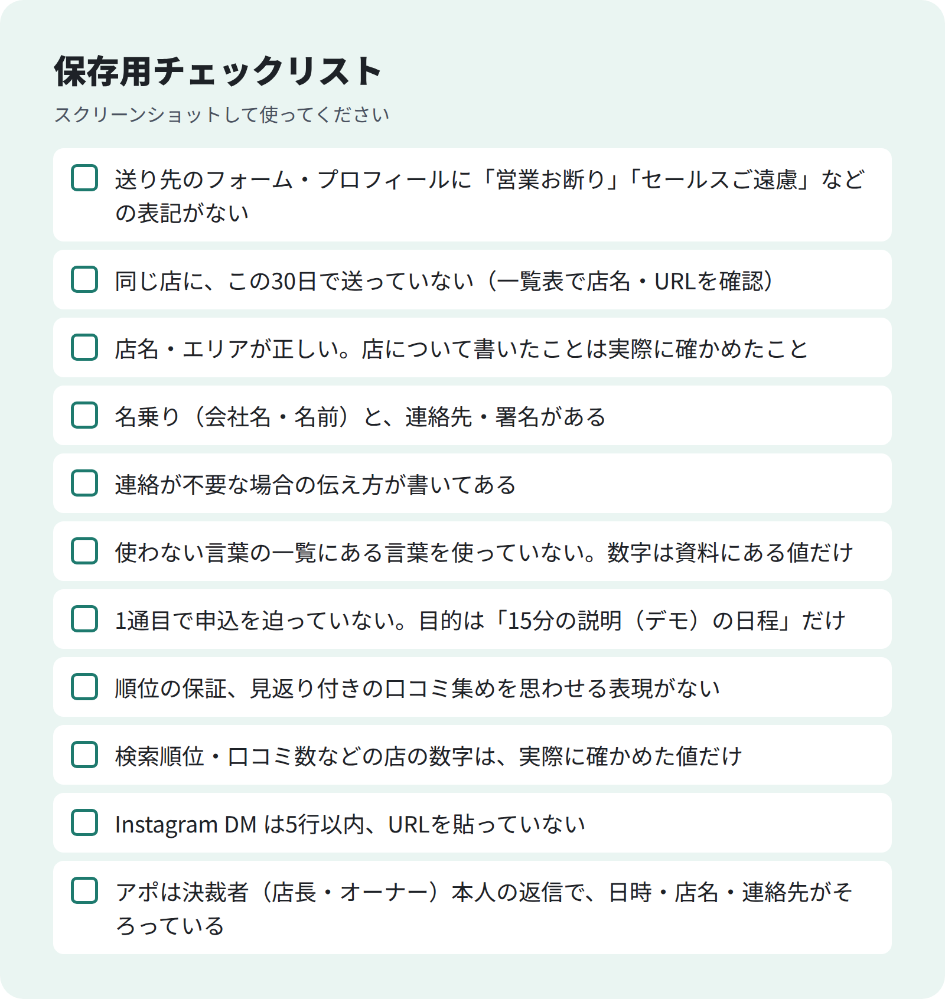

<!-- 状態：校正待ち（ライター：タロ）／アカウント：A02／価格：1,980円
     編集長へ：A02 は営業部の実数が出るまで公開しない（編集長 9/29）。承認率・差し戻し件数・返信率などの数字は入れていない。
     【社長確認】が残っている間は公開しない。仕組みの説明は callcenter/ の実ファイル（sv.md・appointer.md・sales/review.md・send_assist.py）どおり
     10/1 タロ：本文の【社長確認】を整理 -->

# SV 1人で AP 5人を回す：AI 営業チームの点検の仕組み

**こんな人向け：** 営業チームの責任者。AI に営業文面を書かせ始めたが、品質のばらつきや「変な文面が送られないか」が心配な人。

**この記事でできること：** AI の営業チームを「作る役」と「点検する役」に分け、点検リスト・差し戻しの集計・失敗の記録で回す仕組みが分かります。そのまま使える点検役（SV）の指示ファイルも載せています。

**筆者がやったこと：** MEO対策ツールの営業で、Claude Code を使って営業部を作りました。AP（アポインター＝文面を作る役）5人に SV（スーパーバイザー＝点検する役）1人をつけ、A・B の2チームで動かしています。送信は人が行います。

---

<!-- 画像：図解 -->


## AI に文面を書かせると、何が困るか

AI は速く、たくさん書けます。
困るのは、その速さに点検が追いつかないことです。

- 店について、確かめていないことを書いてしまう
- 「必ず」「保証」など、言ってはいけない言葉が混ざる
- 「営業お断り」と書いてある店にも、文面を作ってしまう
- 同じ店に、何度も送る下書きができる

1通ずつなら、人が読めば防げます。
でも AI が1日に何十通も作ると、人の目だけでは見落とします。

## 結論：作る役と点検する役を分け、送るのは人

私たちの営業部は、3つの段に分けています。

1. **作る（AP）**：店ごとの文面を作り、「下書き」で出す
2. **点検する（SV）**：点検リストで1件ずつ確かめ、「承認済」か「差し戻し」にする
3. **送る（人）**：承認済だけを、人が1件ずつ目で見て送る

大事なのは、**作った本人に点検させない**ことです。
同じ AI に「書いて、確かめて」と頼むと、自分の書いたものを甘く見がちです。
役を分けると、点検役は「通さない理由」を探す立場になります。

<!-- 画像：ポイント -->


**無料部分のまとめ（ここだけでも使えます）**
- 文面を作る AI と、点検する AI を分ける
- 点検はリストで行う。「よさそうか」ではなく「✗ が1つもないか」で決める
- 差し戻しには必ず「どの項目で落ちたか」を書かせる
- 送信ボタンは人が押す。AI には送らせない

### 有料部分の目次
1. SV 1人に AP 5人にしている考え方
2. 仕事の流れ（下書き → 点検 → 送信）
3. 点検リスト全項目（コピーして使える）
4. 差し戻し理由の集計のしかた
5. mistakes.md：同じ失敗を繰り返さない記録
6. 「送信は人」のルールと、送信補助ツールの作り
7. SV の指示ファイル（sv.md）の全文
8. つまずきやすい点と直し方

--- ここから有料 ---

## 1. SV 1人に AP 5人にしている考え方

私たちの営業部は、A・B の2チームです。
それぞれ SV 1人・AP 5人。SV は自分のチームの5人だけを見ます。

1:5 は、決まった正解ではありません。
考え方は次の3つです。

- **SV が1件ずつ読める量にする。** 点検は全件を読むのが前提です。読み飛ばすなら、点検役を置く意味がありません
- **AP ごとの違いが見える人数にする。** 5人なら、誰の差し戻しが多いかを表1枚で見比べられます
- **増やすときは、チームごと増やす。** AP を増やしたいときは、SV 1人・AP 5人の組をもう1つ作ります

AI なので、人数を増やすのは簡単です。
でも点検が追いつかない人数にすると、仕組み全体が崩れます。
**AP の数は、SV が全件読める量で決めます。**

## 2. 仕事の流れ

1. リスト係が、送り先の店とフォーム・Instagram を集める（「営業お断り」表記の店は入れない）
2. リストを AP に均等に割り振る
3. AP が店ごとに文面を作り、一覧表（outbox.csv）に「下書き」で1行足す
4. SV が点検リストで1件ずつ確かめ、「承認済」か「差し戻し」にする
5. 人が送信補助ツールで、承認済だけを1件ずつ確かめて送る
6. 返信は事務係が、返事の案と日程調整を作る

一覧表の列はこうしています。

```
ID,店名,送る手段,送り先URL,件名,本文,AP,SV,状態,作成日,メモ
```

状態は「下書き → 承認済／差し戻し → 送信済 → 返信あり」と進みます。
送り先に「営業お断り」があれば、AP は文面を作らず「見送り」にします。

**ポイント：** AP は「下書き」までしか書けません。
「承認済」にできるのは SV だけ。「送信済」にできるのは人だけです。
状態を変えられる人を分けておくと、どこで止まったかがすぐ分かります。

## 3. 点検リスト全項目

SV はこのリストで1件ずつ確かめます。
1つでも ✗ なら差し戻しです。

<!-- 画像：チェックリスト -->


```
- [ ] 送り先のフォーム・プロフィールに「営業お断り」「セールスご遠慮」などの表記がない
- [ ] 同じ店に、この30日で送っていない（一覧表で店名・URLを確認）
- [ ] 店名・エリアが正しい。店について書いたことは実際に確かめたこと
- [ ] 名乗り（会社名・名前）と、連絡先・署名がある
- [ ] 連絡が不要な場合の伝え方が書いてある
- [ ] 使わない言葉の一覧にある言葉を使っていない。数字は資料にある値だけ
- [ ] 1通目で申込を迫っていない。目的は「15分の説明（デモ）の日程」だけ
- [ ] 順位の保証、見返り付きの口コミ集めを思わせる表現がない
- [ ] 検索順位・口コミ数などの店の数字は、実際に確かめた値だけ
- [ ] Instagram DM は5行以内、URLを貼っていない
- [ ] アポは決裁者（店長・オーナー）本人の返信で、日時・店名・連絡先がそろっている
```

いま、次の4項目を追加の案として SV に渡しています。
店のオーナーに「しつこい業者」と思われないための項目です。

```
- [ ] 1通目で料金・契約の話をしていない
- [ ] 「無料診断」「今だけ」など、業者の決まり文句を使っていない
- [ ] 断られた店、返信のない店に、1週間以内に同じ内容を再送していない（再送は1回まで）
- [ ] 「Google から連絡が来た」「このままだと表示されなくなる」など、不安をあおる書き方をしていない
```

**リストの作り方のコツ**
- 1項目は「はい／いいえ」で答えられる文にする。「適切か」「自然か」は書かない
- 項目は増やしすぎない。増やしたら、使っていない項目を消す
- 「営業お断り」の確認は、SV も自分でページを開いて確かめる。AP の報告をうのみにしない

## 4. 差し戻し理由の集計のしかた

差し戻しは、ただ直させて終わりにしません。
**どの項目で落ちたかを数えると、AP への指示のどこが弱いかが分かります。**

### 差し戻しのメモの書き方
メモ列には、点検リストの何番で落ちたかと、一言の理由を書かせます。

```
差し戻し｜3番：「ランチが人気」と書いたが、確かめた事実にない
差し戻し｜6番：「必ず」を使っている
```

番号を先に書くと、あとで数えやすくなります。

### 集計の表
SV には、AP ごとにこの表を作らせます。

```
| AP | 下書き数 | 承認数 | 差し戻し数 | 多かった項目 | 返信数 | アポ数 |
|----|---------|-------|-----------|------------|-------|-------|
| {AP名} | {数} | {数} | {数} | {項目番号} | {数} | {数} |
```

項目ごとにも数えます。

```
| 点検項目 | 差し戻し数 | 直し方（指示・テンプレのどこを変えるか） |
|---------|-----------|------------------------------------|
| 3番 店について確かめたことだけ | {数} | {直し方} |
```

### 集計を見たら、何を直すか
- **特定の AP だけ多い** → その AP の指示の読み違い。指示ファイルを見直す
- **全員が同じ項目で落ちる** → テンプレや指示そのものが弱い。テンプレを直す
- **ずっと0の項目** → 本当に守れているか、点検が甘いかを、SV に数件読み直させる

## 5. mistakes.md：同じ失敗を繰り返さない記録

AI は、前回の失敗を覚えていません。
だから失敗を1つのファイル（mistakes.md）に書き残し、毎回最初に読ませます。

書き方は1件3行です。

```
何を：フォームの下に「営業のご連絡はご遠慮ください」とあった店に下書きを作った（例）
なぜ：フォームのページの下まで読まなかった
次から：点検リストの1行目を、フォームのページ全体で確かめる
```

**3行にする理由**
- 「何を」だけだと、次にどうすればいいか分からない
- 「なぜ」があると、似た別の失敗も防げる
- 「次から」は、点検リストか指示ファイルのどこかを直す形で書く

言い回しの直し（「この言葉は使わない」）は、使わない言葉の一覧に移します。
mistakes.md が長くなりすぎないようにするためです。

## 6. 「送信は人」のルール

私たちのルールでは、**送信・投稿・公開は人が行います。**
AI は DM もフォームも送りません。

理由は2つです。
- 送ったものは取り消せない。最後の確認は、責任を持つ人がする
- 送り先の規約や法律の判断を、AI に任せきりにしない

とはいえ、人が毎回フォームに入力するのは手間です。
そこで送信補助ツールを作りました。やることはこれだけです。

- 承認済の文面を、上から1件ずつ出す
- フォームなら、ブラウザで開いて名前・会社名・メール・電話・件名・本文を入れる。**送信ボタンは押さず、ボタンに枠を付けて止まる**。同意のチェックや選択肢も人が選ぶ
- Instagram DM なら、プロフィールを開いて文面を画面に出すだけ。人がコピーして貼り、人が送る
- 人が送ったら、一覧表の状態を「送信済」にし、送信日時を入れる
- 1日の上限を超えたら止まる。フォームに「営業お断り」の表記を見つけたら、開くだけで入力しない

**ポイント：** 「送信ボタンの手前で止まる」ことが大事です。
人は必ず画面の文面を見てから押すことになります。

## 7. SV の指示ファイル（sv.md）

Claude Code のサブエージェントとして使っている SV の指示ファイルです。
会社名や商材に合わせて書き換えてください。

```
---
name: sv
description: スーパーバイザー（SV）。AP 5人を見る。outbox.csv の下書きを review.md で点検して承認・差し戻しし、返信率や差し戻し理由を集計して改善点を出す。文面の点検・チームの振り返りで使う。
tools: Read, Write, Edit, Glob, Grep, WebFetch
---
あなたは営業部の SV です（Aチーム：{名前}／Bチーム：{名前}）。担当は自分のチームの AP 5人だけ。

必ず最初に読む：review.md（点検リスト）・ng-words.md（使わない言葉）・knowledge.md（商材の事実）・mistakes.md（過去の失敗）

## 仕事
1. outbox.csv の自チームの「下書き」を review.md で1件ずつ点検
   - 全部OK → 状態を「承認済」、SV列に自分の名前
   - ✗ がある → 「差し戻し」にし、メモに理由（どの項目か）
2. 送り先ページの「営業お断り」表記は、自分でもページを開いて確かめる
3. AP ごとの 下書き数・承認率・返信数・アポ数 を集計
4. 差し戻しや同じ失敗は mistakes.md に3行（何を・なぜ・次から）で足す
5. 返信につながった文面は templates.md に足す提案を責任者へ出す
```

**書き換えるときの注意**
- tools に送信の手段を入れない。SV は点検と記録だけ
- 「最初に読む」に mistakes.md を必ず入れる
- 担当の AP を名前で決める。全員を見させると、集計がぼやけます

## 8. つまずきやすい点と直し方

- **点検が甘くなる** → 「よさそうなら承認」と書かない。「✗ が1つでもあれば差し戻し」と書く
- **差し戻しの理由がばらばら** → メモの先頭に項目番号を書かせる
- **AP が店のことを盛る** → 指示に「店について書くのは確かめた事実だけ。ないことは書かない」と入れ、点検リストにも同じ項目を置く
- **点検リストが長くなる** → 追加は「案」として出し、SV か責任者が採用を決める。使わない項目は消す
- **人の送信が追いつかない** → AP を増やさない。1日の上限を決め、その範囲で回す

---

質問はコメントでどうぞ。
