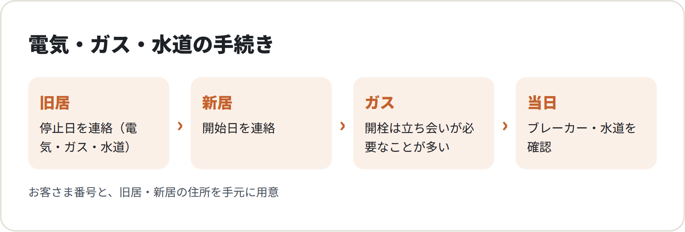
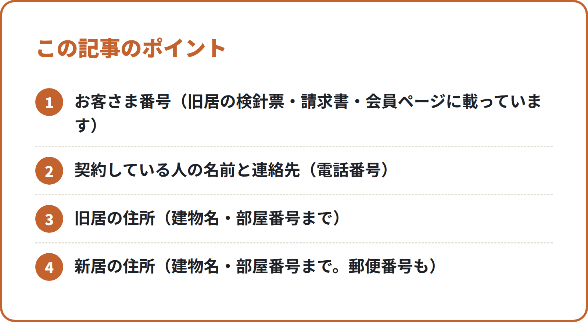

<!-- 状態：校正待ち（ライター：リク・9/30）／アカウント：A11／価格：無料
     制度確認：OK（ジン・9/30。原文未確認の出典は社長が公開前に確認）
     編集長へ：出典はすべて検索結果の要約でしか見られていない（公式ページの本文は取得できなかった）。確認リストの「原文未確認」をジンが原文で確かめる
     締めの「でんき開通サポート」の説明は lp/index.html の記載どおり。対応範囲・費用の書き方は【社長確認】 -->

# 電気・ガス・水道の引越し手続き：いつ・どこに・何を伝えるか

**こんな人向け：** 引越しの日が決まった人。電気・ガス・水道の連絡を、いつ・どこにすればいいのか分からない人。はじめての一人暮らしで、何から手をつければいいか迷っている人。

**この記事で分かること：** 旧居の「止める」手続きと、新居の「始める」手続きの順番。電話やWebで伝える前に手元にそろえておく情報。ガスの開栓で立ち会いが必要になる理由と、日時の決め方。

**結論：** 引越しの日が決まったら、その週のうちに「電気・ガス・水道の3か所」に連絡します。伝えることは、どこもほぼ同じで「お客さま番号・旧居と新居の住所・止める日と始める日」です。ガスだけは、新居で立ち会いが必要になるのが一般的なので、先に日時を押さえておきます。

---

<!-- 画像：図解 -->

## まず全体像：「止める」と「始める」は別の手続き

引越しのライフラインの手続きは、1つの会社に1回連絡すれば終わり、とは限りません。

- **旧居**：使用を止める（電気の停止・ガスの閉栓・水道の使用中止）
- **新居**：使用を始める（電気の使用開始・ガスの開栓・水道の使用開始）

同じ会社・同じ水道局のエリア内の引越しなら、1回の連絡で「止める」と「始める」をまとめて受け付けてもらえることがあります。たとえば東京都水道局は、23区と多摩地区の対象の市町の中での引越しなら、お客さまセンターで一括して手続きを受け付けると案内しています（出典は最後の確認リスト）。

ただ、県をまたぐ引越しや、ガス会社が変わる引越しでは、旧居と新居で連絡先が別々になります。**「旧居の会社」と「新居の会社」をそれぞれ確かめる**ところから始めると、抜けが出にくくなります。

## いつ連絡するか：時期順のやること

### 引越しの日が決まったら（できればその週のうちに）
- 旧居の電気・ガス・水道の会社を確かめる（検針票・請求書・Webの会員ページで分かります）
- 新居の住所が、どのガス会社・どの水道局のエリアかを確かめる（不動産会社や管理会社に聞くのが早いです）
- 電気の契約先をどうするか決める（今の会社を続けるか、新居で選び直すか。下で説明します）

### 引越しの日の少し前まで
- 旧居の「止める日」と、新居の「始める日」を各社に伝える
- **ガスは、新居での開栓の立ち会い日時を予約する**
- 水道は、新居の地域の水道局の案内どおりに申し込む。東京都水道局は、引越しの3〜4日前までの手続きを案内しています

### 引越し当日
- 旧居：ブレーカーを落とす、ガスの元栓を閉めるなど、各社の案内に従う
- 新居：電気はブレーカー（分電盤）を入れる。水道は、水が出るか確かめる。ガスは予約した時間に立ち会う

### 引越しのあと
- 旧居の最後の料金の請求先（支払い方法）が正しいか確かめる
- 新居の検針票やWebの会員ページで、お客さま番号を控えておく

「もう引越しまで数日しかない」という人も、あわてなくて大丈夫です。今日のうちに3か所へ連絡すれば、間に合うことも少なくありません。直前の場合は、Webより電話のほうが、その場で日程を確かめられて安心です。

## 連絡する前に手元にそろえるもの

<!-- 画像：ポイント -->

どの会社に連絡するときも、聞かれることはほぼ同じです。先にメモにまとめておくと、1件あたりの電話が短く済みます。

- **お客さま番号**（旧居の検針票・請求書・会員ページに載っています）
- **契約している人の名前と連絡先**（電話番号）
- **旧居の住所**（建物名・部屋番号まで）
- **新居の住所**（建物名・部屋番号まで。郵便番号も）
- **旧居で止める日**と、**新居で始める日**
- **最後の料金の支払い方法**（口座・クレジットカードなど）
- ガスの場合：**新居で立ち会いができる日時の候補**（第2候補まであると決まりやすいです）

お客さま番号が分からなくても、住所と名前で調べてもらえることが多いです。ただ、番号があるほうが話が早く進みます。検針票を捨てる前に、スマホで写真を撮っておくと安心です。

## 電気：新居で使い始める前に「どこと契約するか」を決める

電気は、2016年4月から家庭向けの販売が自由化され、家庭でも電力会社や料金プランを選べるようになっています（資源エネルギー庁の説明）。引越しは、契約先を見直しやすいタイミングです。

選び方の考え方は、大きく2つです。

1. **今の会社を続ける**：同じ会社が新居のエリアでも電気を売っていれば、住所変更の形で手続きできることがあります
2. **新居で選び直す**：家族の人数や、家にいる時間帯に合うプランを選び直す

どちらを選ぶ場合でも、料金やキャンペーンはすぐ変わります。**契約する前に、各社の公式サイトで料金と契約の条件（契約期間・解約のときの費用など）を確かめてください。**

電気は、スマートメーターが付いている物件なら、立ち会いなしで使用開始の処理ができることが多いです。入居の日に分電盤のブレーカーを入れても明かりがつかないときは、まず契約先の会社に「使用開始の手続きが済んでいるか」を確かめます。

## ガス：開栓には立ち会いが必要になるのが一般的

ガスは、電気や水道と違って、**新居で使い始めるときに係の人が訪問して、立ち会いのもとで開栓する**のが一般的です。ガス機器に安全に火がつくか確かめたり、安全な使い方の説明をしたりするためです。

たとえば東京ガスは、ガスの使用開始の際は立ち会いが必要で、本人が立ち会えない場合は、連絡内容を伝えられる代理の人（大家さん・管理人さんなど）の立ち会いでもよいと案内しています。立ち会いの条件や、予約できる時間帯はガス会社によって違うので、**新居のガス会社で確認**してください。

ここで気をつけたいのは、**立ち会いの日時は、希望どおりに取れるとは限らない**点です。引越しの日が決まったら、ほかの手続きより先にガスの予約を入れておくと安心です。

旧居のガスを止める「閉栓」は、立ち会いが要らない場合もあります。これもガス会社の案内を確かめてください。

## 水道：連絡先は「新居の地域の水道局」

水道は、住んでいる地域の水道局（市区町村など）が担当しています。電気やガスのように会社を選ぶものではありません。

- 連絡先は、**新居の住所を担当する水道局**（市区町村のページで調べられます）
- 旧居と新居で水道局が違うときは、それぞれに連絡します
- 申し込み方法は、電話・Web・アプリなど、水道局ごとに違います

多くの物件では、水道の使用開始に立ち会いは要りません。ただ、水道局や物件によって違うことがあるので、案内を確かめてください。新居に着いたら、まず蛇口をひねって水が出るか確かめます。

## チェックリスト：3か所の連絡、済みましたか

- [ ] 旧居の電気・ガス・水道の会社とお客さま番号を控えた
- [ ] 新居のガス会社と水道局を確かめた
- [ ] 電気の契約先を決めた（続ける／選び直す）
- [ ] 電気：旧居の停止日・新居の開始日を伝えた
- [ ] ガス：旧居の閉栓日を伝え、新居の開栓の立ち会い日時を予約した
- [ ] 水道：旧居の使用中止・新居の使用開始を申し込んだ
- [ ] 最後の料金の支払い方法を確かめた
- [ ] 入居の日に、ブレーカー・蛇口・ガス（立ち会い）の順で確かめる予定を入れた

## よくある失敗

**1. ガスの予約が遅れて、入居してから数日お風呂に入れない**
電気と水道はすぐ使えても、ガスは立ち会いの予約が必要なことが多いです。引越しの日が決まったら、まずガスの予約から入れておきます。

**2. 旧居の停止を忘れて、住んでいない家の料金がかかり続ける**
新居の「開始」だけ申し込んで、旧居の「停止」を忘れる例です。「止める」と「始める」は、1回の電話で両方伝えるつもりで連絡します。

**3. 電気の申し込みがまだで、入居の夜に明かりがつかない**
鍵をもらった安心感で、電気の申し込みを後回しにしてしまう例です。ブレーカーを入れてもつかないときは、契約先の会社に電話で状況を確かめます。

---

## 引越しのこと、まとめて相談できます

電気・ガス・水道の連絡先が多くて手が回らない方には、筆者の会社の「でんき開通サポート」（関東1都6県：東京・神奈川・埼玉・千葉・茨城・群馬・栃木）があります。新居の電気の使用開始のお申し込みを取り次ぎ、ガス・水道・インターネットのお申し込みもあわせてお預かりします。電力会社・ガス会社・水道局の公式窓口ではなく、民間の取次サービスです。【社長確認：対応できる電気・ガス・水道の範囲／「ご相談・お手続きは無料」と書いてよいか】
でんき開通サポート：【社長確認：LPのURL】

筆者の会社では、引越しにまつわる次のご相談をまとめて受けています。
- お部屋探し（仲介手数料を無料にできる物件があります。条件は物件によって違うため、ご相談のときにご説明します。お部屋探しは、提携する不動産会社をご紹介します（物件のご案内・契約・仲介は提携先の不動産会社が行います）【社長確認：提携先の不動産会社名と宅建業の免許番号】）
- 電気・ガス・水道の手続き
- インターネット回線
- ウォーターサーバー
- 関東の引越し業者のご紹介

※紹介するサービスによって、当社が紹介料を受け取る場合があります。【社長確認：書き方】

▶ [引越しの無料相談フォーム](https://【社長確認：引越し相談フォームのURL】?src=N013)

---

## 確認リスト（公開前に消す）

**出典（すべて検索結果の要約で確認。公式ページの本文は取得できず＝原文未確認。ジンが原文で確かめる）**
- 東京都水道局「使用開始・中止について（お引っ越しの手続）」https://www.waterworks.metro.tokyo.lg.jp/faq/qa-4 ：引越しの3〜4日前までの手続き、アプリ・電話での手続き【原文未確認】
- 東京都水道局「手続きに際して」https://www.waterworks.metro.tokyo.lg.jp/tetsuduki/shiyou ：23区・多摩地区の対象市町内の引越しは、お客さまセンターで一括受付【原文未確認】（対象の市町の範囲も原文で確認）
- 東京ガス「ガス・電気の開始や停止のお手続き（お引越し等）」https://home.tokyo-gas.co.jp/gas_power/procedure/moving/index.html 【原文未確認】
- 東京ガス「ガス・電気の使用開始お手続き詳細」https://home.tokyo-gas.co.jp/gas_power/procedure/moving/khsn_k_nagare.html ：使用開始の際は立ち会いが必要、宅内で点火確認と安全事項の説明【原文未確認】
- 東京ガス サポート「日時・立会い」https://support.tokyo-gas.co.jp/category/show/900?site_domain=open ：代理の人（大家・管理人など）の立ち会いでも可【原文未確認】
- 資源エネルギー庁「電力小売全面自由化」https://www.enecho.meti.go.jp/category/electricity_and_gas/electric/electricity_liberalization/ ：2016年4月から家庭でも電力会社・料金プランを選べる【原文未確認】
- 「閉栓は立ち会いが要らない場合もある」「多くの物件で水道の開始に立ち会いは不要」「スマートメーターなら立ち会いなしで使用開始できることが多い」は、ガス会社・水道局ごとの原文で確かめる（スマートメーターの部分は lp/index.html のQ&Aと同じ内容）【原文未確認】

**【社長確認】**
- でんき開通サポートで対応できる電気・ガス・水道の範囲（knowledge.md が未記入）
- 「ご相談・お手続きは無料」と記事に書いてよいか（LPには記載あり。docs/lp.md で表記の確認が必要とされている）
- でんき開通サポートの LP の URL／相談フォームの URL
- お部屋探しの仲介手数料を無料にできる条件
- 紹介料についての書き方
- （済）制度確認係（ジン）の「制度確認：OK」は 9/30 に先頭コメントへ記入
