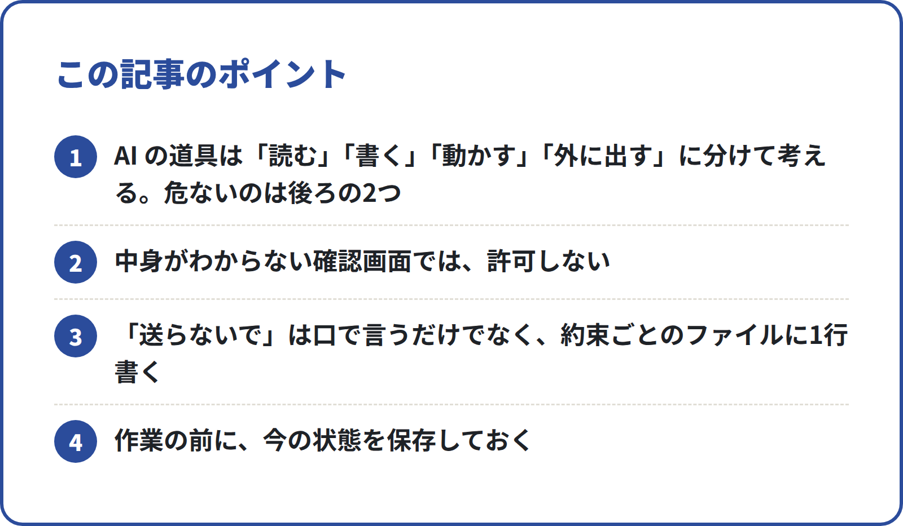
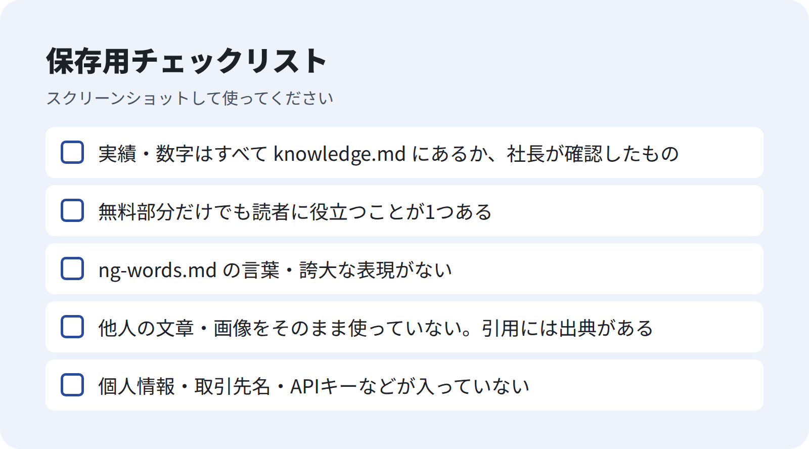

<!-- 状態：校正待ち（ライター：ユキ・10/1）／アカウント：A01／価格：1,480円
     編集長へ：確認待ちの空欄は入れていない。社長にしか書けないこと（始めた時期・実際にファイルが消えた経験など）は書かず、このリポジトリの設定ファイルで確かめられることだけにした。
     タイトルの「非エンジニアの社長が最初に決めた」は社長の実体験として読める。本文は「このチームで決めているルール」として書いた。社長が確かめられない場合は「非エンジニアでも決められる権限と点検のルール」に変える案。
     Claude Code の機能は、変わりにくい一般的なものだけ書いた。公開前に公式ドキュメントで確認する。画像は未作成（build_note_images.py 未実行）
     10/1 編集長：タイトルは実体験と読めない案に変更 -->

# Claude Code にファイルを消されないために：非エンジニアでも決められる権限と点検のルール

**こんな人向け：** Claude Code（AI にパソコン上の作業をさせる道具）を使い始めたけれど、「大事なファイルを消されたら」「勝手に送信されたら」が怖い経営者・一人社長。エンジニアでなくても読めるように書きました。

**この記事でできること：** AI に「何をさせるか」ではなく「何をさせないか」を、3つのルールで決められるようになります。このチームで実際に使っている設定ファイルの実物と、コピーして使える型が入っています。

**この記事の材料：** 自社の営業チームと note の編集チームを、Claude Code で動かしています。その設定ファイル（CLAUDE.md・点検表・役割ごとの指示書・送信の補助ツール）をもとに書きました。

**この記事について：** 2026年10月に書きました。Claude Code の機能名・設定の書き方・画面は変わりやすいので、使う前に公式ドキュメントの最新情報を確認してください。

---

## AI に作業を任せるとき、怖いこと

Claude Code は、チャットの AI と違って、パソコンの中で実際に手を動かします。ファイルを読み、書き、コマンド（パソコンへの命令）を動かせます。

便利な分、怖いところもあります。

- ファイルを書き換える・消す
- メールやフォームを送る、記事を公開する
- 確かめていない内容を、そのまま外に出す

どれも「AI がうっかりやる」と取り返しがつきにくいことです。

## 結論：できることを絞り、外に出すのは人、出す前に点検

このチームで決めているルールは3つです。

1. **役割ごとに、使える道具を絞る**：文章を書く役には、コマンドを動かす道具を渡さない
2. **送信・公開は人が行う**：AI は下書きまで。送信の補助ツールも、送信ボタンの手前で止まる
3. **出す前に点検する**：点検表（review.md）を全部確かめ、引っかかったら直してから出す

そして、万一のために **元に戻せる状態にしておく**。これで「消された」「送られた」の多くは、起きる前に止めるか、起きても戻せます。

<!-- 画像：ポイント -->


**無料部分のまとめ（ここだけでも使えます）**
- AI の道具は「読む」「書く」「動かす」「外に出す」に分けて考える。危ないのは後ろの2つ
- 中身がわからない確認画面では、許可しない
- 「送らないで」は口で言うだけでなく、約束ごとのファイルに1行書く
- 作業の前に、今の状態を保存しておく

### 有料部分の目次
1. 道具を4つに分ける：「読む」「書く」「動かす」「外に出す」
2. 役割ごとに道具を絞る（指示書の `tools:` の実物）
3. 「送信・公開は人」を、約束とツールの両方で決める
4. 出す前の点検表（review.md）と、状態の流れ
5. 直させたことを残す（mistakes.md）
6. 元に戻せるようにしておく
7. コピーして使える型4つ
8. つまずきやすい点と、直し方
9. 明日から始めるチェックリスト

--- ここから有料 ---

## 1. 道具を4つに分ける

Claude Code が使う道具には、それぞれ名前があります。細かく覚えなくて大丈夫です。4つに分けて考えます。

| 分け方 | 道具の例 | できること | 危なさ |
|---|---|---|---|
| 読む | Read・Glob・Grep | ファイルを読む・探す | 低い |
| 書く | Write・Edit | ファイルを作る・書き換える | 中くらい（上書きはできる） |
| 動かす | Bash | コマンドを動かす（ファイルの削除もできる） | 高い |
| 外に出す | 送信・投稿・公開 | 相手に届く | 取り消せない |

ネットで調べる道具（WebSearch・WebFetch）もあります。読むだけですが、**読んだページに書いてあることを、そのまま信じさせない**ことが大事です。

Claude Code には、ファイルを書き換える前やコマンドを動かす前に「実行してよいか」を聞く仕組みがあります。何を聞かずに許すか、何を禁止するかは、設定で決められます。設定の書き方は版によって変わるので、公式ドキュメントで確かめてください。

まず覚えておきたいのは1つです。**確認画面で、中身がわからないものは許可しない。** わからないときは「このコマンドは何をするのか、やさしく説明して」と聞き返せば大丈夫です。

## 2. 役割ごとに道具を絞る

Claude Code では、`.claude/agents/<名前>.md` に役割ごとの指示書を置けます（サブエージェントと呼びます）。指示書のいちばん上に、`tools:` の行で **その役が使える道具** を書けます。

### 実物：note のライターの指示書（冒頭）
```
---
name: note-writer
description: note 事業部のライター。編集長に割り当てられた企画の原稿を note/out/drafts/<ID>.md に書く。
tools: Read, Write, Edit, Glob, Grep
---
```

ライターは「読む」と「書く」だけです。**Bash（コマンドを動かす道具）を持っていません。**

### このチームの割り振り

| 役割 | 使える道具 | 足している理由 |
|---|---|---|
| ライター・編集長・データ分析・マーケ・事務 | Read, Write, Edit, Glob, Grep | 読んで書くだけの仕事 |
| リサーチ | 上に WebSearch, WebFetch を足す | ネットで調べるため |
| SV・アポインター（営業文の点検・作成） | 上に WebFetch を足す | 送り先のページに「営業お断り」がないか確かめるため |
| リスト抽出 | 上に Bash を足す | 抽出ツールを動かすため |

営業部・note 事業部・引越しチームの指示書のうち、**コマンドを動かせるのはリスト抽出の1役だけ**です。道具を足すときは、「なぜ要るか」を1つ言えるものだけにしています。

`tools:` の行を書かないと、多くの道具が使える状態になることがあります（細かい決まりは公式ドキュメントで確認してください）。**指示書を作ったら、必ず `tools:` の行を書く**のが安全です。

### 「書く」だけでも、上書きはできる

注意したいのは、Write・Edit でも既存のファイルを上書きできることです。そこで、指示書の中で **書く場所を1つに決めて** います。ライターなら「`note/out/drafts/<ID>.md` に書く」です。

これは約束で、仕組みで止めるものではありません。だから6章の「元に戻せるようにしておく」とセットにします。

## 3. 「送信・公開は人」を2か所で決める

外に出すことは、取り消せません。このチームでは、AI に送信・公開をさせないと決めています。決め方は2か所です。

### 1か所目：約束ごと（CLAUDE.md）
Claude Code は、作業フォルダの `CLAUDE.md` をセッション（作業のひと区切り）を始めるたびに読みます。そこに1行書いています。

```
- 送信・投稿・公開は人が行う。Claude は DM やフォームを送らず、note やSNSに投稿しない
```

アポインター（営業文を作る役）の指示書にも、同じことを書いています。

```
送信はあなたにはできません（人が tools/send_assist.py で送ります）。
```

### 2か所目：ツールの作り
営業文を送るときは、補助ツールを人が動かします。このツールの説明書きから抜粋します。

```
- フォーム：ブラウザでフォームを開き、名前・会社名・メール・電話・件名・本文を入力して、送信ボタンに枠を付けて止まる
  **送信ボタンは押しません。** 内容を確かめて、人が押してください（同意のチェック・選択肢も人が選ぶ）
- 送ったら Enter（s）で outbox.csv の状態を「送信済」にし、送信日時を入れる
- 1日の上限（sender.yaml の daily_limit）を超えたら止まる。営業お断り表記が見つかったフォームは開くだけで入力しない
```

入力の手間は機械に任せ、**最後のボタンだけは人が押す**。同意のチェックも人が選びます。

## 4. 出す前の点検：review.md

AI が作ったものは、外に出す前に点検表で確かめます。note の記事用の点検表から抜粋します。

<!-- 画像：チェックリスト -->


```
原稿・SNS 投稿案を出す前に全部確かめる。1つでも ✗ なら直してから出す。

- [ ] 実績・数字はすべて knowledge.md にあるか、社長が確認したもの
- [ ] 無料部分だけでも読者に役立つことが1つある
- [ ] ng-words.md の言葉・誇大な表現がない
- [ ] 他人の文章・画像をそのまま使っていない。引用には出典がある
- [ ] 個人情報・取引先名・APIキーなどが入っていない
```

最後の項目は、権限の話とつながっています。**AI はフォルダの中のものを読めるので、記事や文面に入り込むことがあります。** 出す前に目で確かめます。

### 状態の流れ
点検の前と後で、ファイルに「状態」を書いています。どこまで進んだかが、ひと目でわかります。

- 営業文：下書き（アポインター）→ 承認済・差し戻し（SV が点検）→ 送信済（人が送って記録）
- note の記事：校正待ち（ライター）→ ストック（編集長が点検）→ 公開（社長）

どちらも、**最後の一歩は人**です。

## 5. 直させたことを残す：mistakes.md

直させたことは、AI 自身に3行で書かせます。次の作業で同じ失敗を繰り返さないためです。

```
何を：確認していない売上の数字を原稿に書いた（例）
なぜ：knowledge.md にない数字を推測で埋めた
次から：数字がないときは空けておく
```

CLAUDE.md に「作業の終わりに、直された点を mistakes.md に足す」と1行書いておくと、頼み忘れがなくなります。

## 6. 元に戻せるようにしておく

どれだけ絞っても、「書く」道具を渡す以上、上書きは起こりえます。だから、**消されても戻せる状態** を先に作ります。

- **Git（変更の履歴を残す道具）で管理する**：このチームのフォルダも Git で管理しています。作業の前に今の状態を保存（コミット）しておけば、あとから元に戻せます
- **Git が難しければ、フォルダごと控えを取る**：作業の前に、大事なフォルダをコピーして別の場所に置く
- **AI に渡すフォルダを分ける**：経理・契約書など、AI に触らせなくてよいファイルは、作業フォルダに入れない

3つ目がいちばん簡単で、効きます。**AI が開くフォルダに無いものは、消されません。**

## 7. コピーして使える型

### 型1：CLAUDE.md
```
# CLAUDE.md
この仕事の目的：〇〇（1行）

## 守ること
- 送る・公開するのは私。AI は下書きまで
- ファイルを消さない。消す必要があるときは、理由を書いて私に聞く
- 数字は、私が渡した資料にあるものだけ使う。なければ空けておく
- 出す前に review.md を全部確かめて、引っかかったら直す
- 作業の終わりに、直された点を mistakes.md に足す（何を・なぜ・次からどうするか）
```

### 型2：役割の指示書（`.claude/agents/writer.md`）
```
---
name: writer
description: 〇〇の下書きを drafts/ に書く係
tools: Read, Write, Edit, Glob, Grep
---
あなたは〇〇の下書き係です。
必ず最初に読む：CLAUDE.md review.md

## 仕事
1. 渡された内容で、drafts/<名前>.md に下書きを書く（ほかの場所には書かない）
2. 出す前に review.md を全部確かめ、引っかかったら直す
3. 送信・公開はしない
```

### 型3：review.md
```
# review.md（出す前の点検）
1つでも ✗ なら直してから出す。

- [ ] 数字は、渡した資料にあるものだけ
- [ ] 個人情報・取引先名・パスワード・APIキーが入っていない
- [ ] 言ってはいけない言葉がない
- [ ] 書いたのは決められた場所だけ
```

### 型4：頼み方の文例
```
CLAUDE.md を読んでから、〇〇の下書きを作って。
ファイルを消す・コマンドを動かす必要があるときは、やる前に何をするか説明して。
出す前に review.md を全部確かめて、引っかかったら直す。
```

## 8. つまずきやすい点と、直し方

| つまずき | 原因 | 直し方 |
|---|---|---|
| 指示書の役が、思ったより多くの道具を使う | `tools:` の行を書いていない | 指示書には必ず `tools:` を書き、要る道具だけ並べる |
| 確認画面を、よく読まずに許可してしまう | 中身がわからない | わからないものは許可せず、「何をするのか説明して」と聞く |
| 書く係なのに、別のファイルが書き換わった | Write・Edit は上書きもできる | 書く場所を指示書で1つに決める。作業の前に保存しておく |
| 「送らないで」と言ったのに不安が残る | 口で言っただけ | CLAUDE.md に1行書く。送信のツールは、ボタンの手前で止まる作りにする |
| 点検したと言うのに、直っていない | 「確かめて」だけ頼んでいる | 「引っかかったら直す」まで1行に入れる |

## 9. 明日から始めるチェックリスト

- [ ] AI に渡すフォルダから、触らせなくてよいファイルを外す
- [ ] 作業の前に、今の状態を保存する（Git か、フォルダの控え）
- [ ] CLAUDE.md に「送る・公開するのは私」「ファイルを消さない」を書く
- [ ] 役割の指示書に `tools:` を書き、コマンドを動かす道具（Bash）は本当に要る役だけに渡す
- [ ] review.md を作り、「出す前に全部確かめて、引っかかったら直す」と頼む
- [ ] 確認画面で、中身がわからないものは許可しない

---

質問はコメントでどうぞ。
