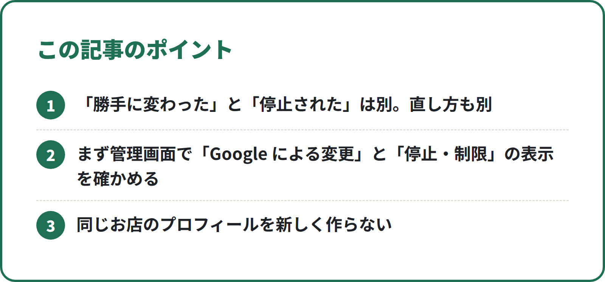
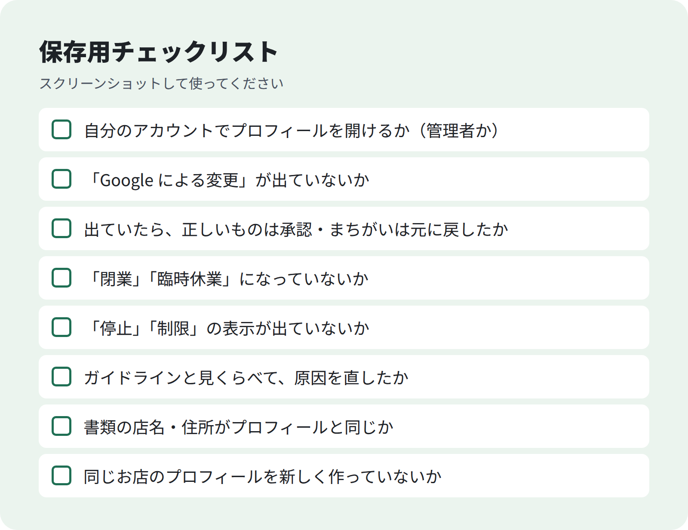

<!-- 状態：校正待ち（ライター：ハナ・10/1）／アカウント：A03／価格：1,480円
     編集長へ：Google のヘルプは、この環境から support.google.com を開けず（接続がブロック）、検索結果の要約でしか確かめられていない。本文の Google の説明はすべて公開前に原文と照合する（末尾の一覧）。所要日数・期間は原文を読めていないので書いていない
     根拠メモ（articles.csv）の nexer.co.jp の記事は公式ではないので本文には使っていない。「4日で自動反映」「閉業の選択肢が消えた」など公式ヘルプで確かめられない話も書いていない
     価格 1,480円は A03 の目安（1,980〜4,980円）より低い。articles.csv どおりにした
     画像は `python tools/build_note_images.py N018` でまだ作っていない（下の画像の行は N007 と同じ位置の仮置き）
     無料相談フォームの案内（9/30 社長の指示）：「相談は無料」「無理な勧誘はしない」「順位の保証はしない」が実際の対応と合っているか社長が確認。フォームの URL は公開後に入れる -->

# Googleマップの店舗情報が勝手に変わった・停止された：店舗オーナーが最初に確かめることと直し方

**こんな人向け：** 美容室・整骨院・飲食店などの店長やオーナー。Googleマップを見たら、営業時間や電話番号が知らないうちに変わっていた。「閉業」と出ていた。プロフィールが「停止」と表示された。どうしていいか分からない人。

**この記事でできること：** 「勝手に変わった」と「停止された」を見分けて、それぞれ最初に確かめることと、Google の公式ヘルプに書かれている直し方の順番が分かります。やると状況が悪くなりやすいことも分かります。

**筆者について：** 店舗向けに MEO（Googleマップ集客）のツールを案内する仕事をしています。【社長確認：MEO に関わった期間・担当した店舗の数など、確認できる事実だけ】

---

## まず落ち着いて：「変わった」と「停止された」は別のこと

どちらも「Googleマップがおかしい」に見えますが、原因も直し方も違います。

**① 情報が勝手に変わった**
Google の公式ヘルプでは、Google はユーザーからの報告など、さまざまな情報源から情報を集めていて、情報が正しくない・古いと報告されると、Google がプロフィールを更新することがあると説明されています（[ビジネス プロフィールに対する Google による変更を管理する](https://support.google.com/business/answer/3480441?hl=ja)）。
また、お店の人でなくても、Googleマップを使う人は情報の修正を「提案」できます（[ビジネス プロフィールを編集する](https://support.google.com/business/answer/3039617?hl=ja)）。

つまり「誰かにいたずらされた」とは限りません。**まずは、何が・どう変わったかを管理画面で確かめる**のが先です。

**② プロフィールが停止された・制限された**
公式ヘルプでは、Google のガイドラインに従っていないプロフィールは、停止や無効化されることがあり、回復するのが妥当だと考える場合は **再審査を請求できる** と説明されています（[停止または無効化されたプロフィールを修正する](https://support.google.com/business/answer/4569145?hl=ja)）。

## 最初に確かめる3つ（どちらの場合も）

1. **自分がそのプロフィールの管理者になっているか**
   Google のアカウントでログインして、自分のお店のプロフィールを開けるか確かめます。お店の名前や営業時間を編集するには、オーナー確認が必要です（[Google でビジネスのオーナー確認を行う](https://support.google.com/business/answer/7107242?hl=ja)）。
2. **管理画面に「Google による変更」が出ていないか**
   出ていれば「①変わった」のパターンです。
3. **「停止」「制限」の表示やお知らせが出ていないか**
   出ていれば「②停止された」のパターンです。

## いちばん大事な注意：同じお店のプロフィールを新しく作らない

慌てて「作り直せばいい」と考えがちですが、公式ヘルプでは、**再審査請求の審査中は、同じビジネスの新しいプロフィールを作らないように** と書かれています（[停止または無効化されたプロフィールを修正する](https://support.google.com/business/answer/4569145?hl=ja)）。

有料部分では、パターンごとの直し方の手順、「閉業」にされていたときの戻し方、再審査請求で用意する書類、慌てたときに確かめるチェックリストを載せています。


<!-- 画像：ポイント -->


**無料部分のまとめ（ここだけでも使えます）**
- 「勝手に変わった」と「停止された」は別。直し方も別
- まず管理画面で「Google による変更」と「停止・制限」の表示を確かめる
- 同じお店のプロフィールを新しく作らない

### 有料部分の目次
1. 情報が勝手に変わったときの直し方
2. 「閉業」「臨時休業」にされていたときの戻し方
3. 管理者になっていない・オーナー確認がまだのとき
4. 停止・制限されたときの再審査請求の流れ
5. 再審査請求の前に用意しておくもの
6. やると状況が悪くなりやすいこと
7. 慌てたときのチェックリスト

> **自分でやるのは難しそう、と思った方へ**：無料でご相談いただけます。▶ [Googleマップ集客の無料相談フォーム](https://【社長確認：フォームを公開したURL】?src=N018)

--- ここから有料 ---

## 1. 情報が勝手に変わったときの直し方

公式ヘルプ（[Google による変更を管理する](https://support.google.com/business/answer/3480441?hl=ja)）では、Google による変更は、**もともとの情報の横に表示され**、それを見てどうするかを選べると説明されています。選べることは次のとおりです。

| したいこと | やり方（公式ヘルプの説明） |
|---|---|
| 変更が正しいので受け入れる | ページ上部で変更をすべて承認する。または、承認したい変更がある項目を選んで「適用」 |
| 変更がまちがっているので元に戻す | 破棄したい変更がある項目を選び、元の内容に戻して「適用」 |
| 自分で正しい内容に直す | 変更の内容を編集する |

手順：
1. 自分のお店のプロフィールを開き、「プロフィールを編集」に進む
2. Google による変更が出ている項目を1つずつ確かめる
3. 正しいものは承認、まちがっているものは元に戻す
4. 保存したあと、編集内容に表示されるステータスを確かめる。「承認済み」になると、更新した情報がプロフィールに表示されます（[ビジネス プロフィールの編集内容の反映](https://support.google.com/business/answer/3038311?hl=ja)）

**注意：** 公式ヘルプには、Google による変更の **すべてが** プロフィールの中で管理できるわけではない、とも書かれています。管理画面で見つからない変更があっても、自分の操作ミスとは限りません。

**直したあとにやること：** 店の看板・ホームページ・予約サイトの情報と、Google の情報が同じかを見直します。お店の外にある情報と Google の情報が食い違っていると、お客さんがどちらが正しいか分からなくなるためです。

## 2. 「閉業」「臨時休業」にされていたときの戻し方

公式ヘルプ（[ビジネス情報を営業中に再設定する](https://support.google.com/business/answer/15300571?hl=ja)）では、営業中に戻すと、Googleマップと Google 検索で「臨時休業」「閉業」の表示が出なくなると説明されています。

1店舗の場合の手順：
1. 自分のお店のプロフィールに移動する
2. 「プロフィールを編集」→「営業時間」を選ぶ
3. 営業時間の編集で「決まった営業時間で営業している」を選ぶ

**注意：** 同じヘルプには、**所在地や名称の変更にともなって閉業マークが付いた場合は、営業中に戻せない** と書かれています。その場合は、新しいビジネス情報を追加するよう案内されています。移転や店名変更をしたあとに「閉業」になっていたら、このパターンかどうかを先に確かめてください。

## 3. 管理者になっていない・オーナー確認がまだのとき

「昔だれかが登録したまま」「前の店長のアカウントで管理していた」というときは、まず自分のアカウントで管理できる状態にします。

- オーナー確認の方法には、電話・SMS、メール、ビデオ通話、はがき などがあります。**どの方法が使えるかは Google が自動で決め、自分では選べない** と公式ヘルプに書かれています。お店の業種や地域などによって変わり、複数の方法での確認が必要になることもあります（[Google でビジネスのオーナー確認を行う](https://support.google.com/business/answer/7107242?hl=ja)）
- すでにほかの人がオーナーになっている場合は、オーナー権限をリクエストする手順が公式ヘルプにあります（[ビジネス プロフィールのオーナー権限をリクエストする](https://support.google.com/business/answer/4566671?hl=ja)）

## 4. 停止・制限されたときの再審査請求の流れ

1. **原因になりそうなところを直す**
   公式ヘルプでは、ガイドラインに従っていないプロフィールが停止・無効化されると説明されています。まず [Google に掲載するビジネス情報のガイドライン](https://support.google.com/business/answer/3038177?hl=ja) と自分のプロフィールを見くらべます（例：お店の名前にキーワードを足していないか、実際にお客さんに対応している住所か）
2. **再審査請求ツールを開く**
   プロフィールに関連付けられた Google アカウントでログインし、プロフィールを選んで進みます（[ビジネス プロフィールのコンテンツとプロフィールの制限に対する再審査請求](https://support.google.com/business/answer/13597551?hl=ja)）
3. **証拠書類を出す**
   証拠書類の提出を求められることがあり、公式ヘルプでは、再審査請求の裏付けとして出すことが強くすすめられています
4. **審査を待つ**
   審査中は、**同じお店の新しいプロフィールを作らない**（[停止または無効化されたプロフィールを修正する](https://support.google.com/business/answer/4569145?hl=ja)）

プロフィール全体ではなく、口コミや写真などの一部のコンテンツが制限された場合も、同じ再審査請求のページから請求できると説明されています（[再審査請求](https://support.google.com/business/answer/13597551?hl=ja)・[ポリシー違反によるビジネス プロフィールの制限](https://support.google.com/business/answer/14114287?hl=ja)）。

## 5. 再審査請求の前に用意しておくもの

公式ヘルプで、再審査請求の裏付けに役立つ証拠書類としてあげられているものです（[停止または無効化されたプロフィールを修正する](https://support.google.com/business/answer/4569145?hl=ja)）。

| 書類 | 手元にあるか |
|---|---|
| 正式な事業登録証 | |
| 営業許可証 | |
| 納税証明書 | |
| 事業用の公共料金の請求書（電気・電話・水道・インターネット） | |

**いちばん大事なこと：** 書類に書かれている **お店の名前と住所が、再審査を請求するプロフィールと同じか** を確かめます（同じヘルプで、一致していることを確認するよう書かれています）。
書類の店名とプロフィールの店名がちがう場合は、どちらが正しいかを先に整理してください。

## 6. やると状況が悪くなりやすいこと

| やらないこと | 理由 |
|---|---|
| 同じお店のプロフィールを新しく作る | 公式ヘルプで、再審査請求の審査中は作らないよう書かれている |
| 直さないまま再審査請求を出す | 停止はガイドラインに従っていないことが理由。原因を直さないと、請求の理由が説明できない |
| お店の名前にキーワードを足して「目立たせる」 | ビジネス名のガイドライン違反（[ガイドライン](https://support.google.com/business/answer/3038177?hl=ja)） |
| 書類と違う店名・住所のまま請求する | 名前と住所が一致しているか確かめるよう書かれている |
| 「すぐ復活させます」「必ず戻します」という業者にまかせる | 審査をするのは Google。結果を約束できる人はいない |

## 7. 慌てたときのチェックリスト


<!-- 画像：チェックリスト -->


```
- [ ] 自分のアカウントでプロフィールを開けるか（管理者か）
- [ ] 「Google による変更」が出ていないか
- [ ] 出ていたら、正しいものは承認・まちがいは元に戻したか
- [ ] 「閉業」「臨時休業」になっていないか
- [ ] 「停止」「制限」の表示が出ていないか
- [ ] ガイドラインと見くらべて、原因を直したか
- [ ] 書類の店名・住所がプロフィールと同じか
- [ ] 同じお店のプロフィールを新しく作っていないか
```

## 「自分でやるのは難しい」と思ったら

ここまで読んで、「時間がない」「自分でやるのは不安」と感じた方は、お気軽にご相談ください。筆者の会社で、Googleビジネスプロフィールの整え方をご案内しています。

- 相談は無料です
- 無理な勧誘はしません。ご案内だけで終わっても大丈夫です
- 順位の保証はしていません（表示順位は Google が決めるためです）

▶ **[Googleマップ集客の無料相談フォーム](https://【社長確認：フォームを公開したURL】?src=N018)**（お店の名前・エリア・お困りのことを入れるだけ。2分ほどで送れます）

質問はコメントでどうぞ。

---

### 社長に原文を確認してほしい Google ヘルプ（公開前）
すべて **原文未確認**（この環境から support.google.com を開けず、検索結果の要約でしか確かめていない）
- Google による変更を管理する：https://support.google.com/business/answer/3480441?hl=ja（原文未確認）
- ビジネス プロフィールを編集する（編集の提案）：https://support.google.com/business/answer/3039617?hl=ja（原文未確認）
- 編集内容の反映（ステータス）：https://support.google.com/business/answer/3038311?hl=ja（原文未確認）
- 営業中に再設定する：https://support.google.com/business/answer/15300571?hl=ja（原文未確認）
- オーナー確認を行う：https://support.google.com/business/answer/7107242?hl=ja（原文未確認）
- オーナー権限をリクエストする：https://support.google.com/business/answer/4566671?hl=ja（原文未確認）
- 停止または無効化されたプロフィールを修正する：https://support.google.com/business/answer/4569145?hl=ja（原文未確認）
- コンテンツとプロフィールの制限に対する再審査請求：https://support.google.com/business/answer/13597551?hl=ja（原文未確認）
- ポリシー違反によるビジネス プロフィールの制限：https://support.google.com/business/answer/14114287?hl=ja（原文未確認）
- ビジネス情報のガイドライン：https://support.google.com/business/answer/3038177?hl=ja（原文未確認）
（この一覧は公開前に消す）
