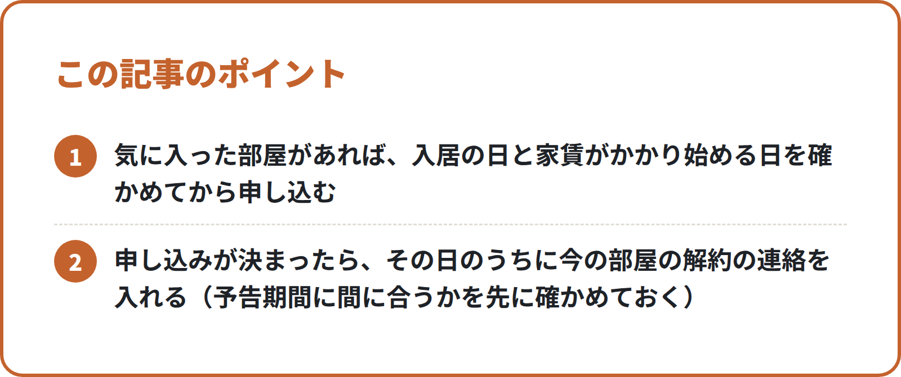

<!-- 状態：校正待ち（ライター：アオイ・10/1）／アカウント：A11／価格：無料
     制度確認：済（ジン・10/1）＋直した点：①出典が民間サイト1つだけの「1〜3月は物件が早く決まりやすい」を削除し、国土交通省の「3〜4月に引越しの依頼が集中」（各年の報道発表で同じ言い方）に差し替え ②借主負担の例を、ガイドラインの例どおり「結露を放置して広がったカビ・シミ」に直し、「善管注意義務」を追記 ③民法621条を本文に明記。宅建業法（提携先をご紹介・仲介は提携先）・紹介料の表示・ng-words は問題なし。原文未確認の出典は社長が公開前に確認
     編集長へ：10/1 の指示どおり、手数料の無料の話はこの記事では一切書いていない（本文・締め・確認リストとも）
     国土交通省のページは作業環境から開けず、検索結果の要約で確かめた（確認リストに「原文未確認」）。「1〜3月は物件が早く決まりやすい」は民間の不動産会社サイトの見方なので、本文では「〜と言われます」とし、数字は書いていない
     N012（内見と申込の前に見る10のこと）と重ならないよう、内見の中身は書かず「いつ・何を始めるか」と退去に絞った -->

# 春に引越すなら部屋探しは秋冬から：10〜12月に始める段取りと、今の部屋の退去で確かめること

**こんな人向け：** 1〜3月に関東で引越しを考えている人。まだ物件を探し始めていないけれど、春に慌てたくない人。今の部屋を出るときの費用が気になっている人。

**この記事で分かること：** 10〜12月の3か月で進める部屋探しの段取り。今の部屋の契約書で先に見ておくこと。退去のときの費用の考え方（国土交通省のガイドライン）と、立ち会いで確かめること。

**結論：** 10月は「条件と今の契約書」、11月は「相場と候補のエリア」、12月は「引越しの時期と退去の日」を決めます。物件の申し込みは1〜2月が中心になりますが、**準備を秋のうちに済ませておくと、良い物件を見つけたその日に動けます**。退去の費用は、国土交通省の「原状回復をめぐるトラブルとガイドライン」で考え方を知っておきます。

---

## なぜ秋冬から始めるのか

1〜3月は、進学・就職・転勤で部屋を探す人や引越す人が増える時期です。国土交通省も、引越しの依頼が3〜4月に集中するとして、毎年、引越しの時期をずらす協力を呼びかけています。

ただ、空いている部屋は、申し込みから入居まで長く待ってもらえないことが多いです。3月に住む部屋を10月に申し込む、ということは、ふつうはできません。

だから秋冬にやるのは、**物件を押さえることではなく、決める準備**です。

- 何を優先するか（家賃・駅・広さ）がはっきりしている
- 今の部屋をいつ・どう出るかが分かっている
- 申し込みに必要な書類がそろっている

この3つができていれば、1〜2月に気に入った部屋に出会ったとき、その場で申し込めます。まだ10月なら、時間は十分にあります。

## 10〜12月の段取り

### 10月：条件を書き出し、今の契約書を読む
**条件を書き出す**
- 家賃の上限（管理費・共益費を含めた月の合計で考える）
- 通勤・通学の時間の上限と、使いたい駅や路線
- 間取り・広さ・階数・設備で「ゆずれないもの」を3つまで
- 入居したい時期（何月何日ごろから住みたいか）

**今の部屋の契約書で見ること**
- **解約の予告期間**：出る日の何か月前（何日前）までに連絡するか
- **解約の連絡の方法**：電話でよいか、書面が要るか
- **原状回復の特約**：ハウスクリーニング代などを借主が負担する特約があるか
- **敷金**の額と、精算のしかた

契約書が見つからないときは、管理会社か大家さんに写しをもらえるか聞いてみてください。

### 11月：相場を知り、候補のエリアを絞る
- 不動産のポータルサイトで、条件に近い物件の家賃を見て、相場の感覚をつかむ
- 候補のエリアを2〜3か所に絞り、休日に駅のまわりを歩いてみる
- 初期費用（敷金・礼金・前家賃・保険・保証会社など）が、家賃の何か月分くらいになりそうか見積もり、貯めておく額を決める

この時期に実際の部屋を内見しても、春まで空いていることは少ないです。内見は「間取りや広さの感覚をつかむ練習」くらいに考えると、がっかりせずに済みます。

### 12月：引越しの時期と、退去の日を決める
- 引越しの時期を決める（3月の最終週や土日は引越し業者も混むので、ずらせるか考える）
- 今の部屋の**退去の日**を、解約の予告期間から逆算して決める
- 新しい部屋の家賃がかかり始める日と、今の部屋の家賃が終わる日の重なり（二重の家賃）を、何日までなら許せるか決める
- 申し込みに使う書類（本人確認書類・収入を示す書類など）の準備を始める。必要な書類は不動産会社や保証会社によって違うので、申し込む前に確かめる

### 1〜2月：準備ができていれば、ここからは早い
秋冬の準備ができていれば、1〜2月は「探す・見る・決める」に集中できます。

- 書き出した条件をそのまま不動産会社に伝え、候補を出してもらう
<!-- 画像：ポイント -->

- 内見の日は、まとめて2〜3件見られるように休みを空けておく
- 気に入った部屋があれば、入居の日と家賃がかかり始める日を確かめてから申し込む
- 申し込みが決まったら、その日のうちに今の部屋の解約の連絡を入れる（予告期間に間に合うかを先に確かめておく）

解約の連絡は、新しい部屋の審査が通り、契約の日が見えてから出すのが安心です。先に出してしまうと、審査が通らなかったときに住む部屋がなくなってしまうことがあります。

## 今の部屋の退去で確かめること

### 退去の費用の考え方：国土交通省のガイドライン
退去のときに、部屋をどこまで元に戻すか（原状回復）、その費用を誰が負担するかで、もめることがあります。国土交通省は、その一般的な考え方を「原状回復をめぐるトラブルとガイドライン」にまとめています。

大まかな考え方は次のとおりです。

- **経年変化**（日焼けなど、時間がたってできる傷み）や**通常損耗**（ふつうに暮らしていてできる汚れや傷）は、貸主の負担
- 借主が負担するのは、**故意・過失**による汚れや傷、**ふつうの使い方を超える使い方**でできた傷み（たとえば、結露を放置して広がったカビやシミなど、借りた部屋を注意して使う義務＝善管注意義務を守らなかったためにできた傷み）

2020年4月に施行された改正民法（621条）でも、通常損耗や経年変化については、借主は原状回復の義務を負わないことが明記されています。

ただし、契約書に**特約**（ハウスクリーニング代は借主が負担する、など）がある場合は、その内容も関わります。ガイドラインは一般的な基準なので、**自分の契約書の内容とあわせて**確かめてください。

### 入居のときの記録を探す
国土交通省は、原状回復の問題を「退去のときだけの問題」ではなく、**入居のときの問題**としてとらえ、入居と退去のときに部屋の状態をよく確かめておくことを勧めています。

- 入居のときに撮った写真や、管理会社に出したチェック表があれば探しておく
- ない場合は、今の部屋の傷や汚れのうち「入居のときからあったもの」をメモにしておく

### 退去の立ち会いで確かめること
- 傷や汚れを一緒に見て、**どれが借主の負担と言われているか**をその場で確かめる
- 気になる傷は、その場で写真を撮る
- 費用の見積もりや精算書は、**内訳（どこを・何を・いくらで）**が書かれたものをもらう
- その場で決めきれないときは、内容を持ち帰って確かめたいと伝える

話がまとまらないときは、消費者ホットライン「188」や、住んでいる自治体の相談窓口に相談できます。

## チェックリスト：10〜12月にやること

- [ ] 家賃の上限・駅・ゆずれない条件3つを書き出した
- [ ] 今の部屋の契約書で、解約の予告期間と連絡の方法を確かめた
- [ ] 契約書の原状回復の特約と、敷金の額を確かめた
- [ ] 候補のエリアを2〜3か所に絞った
- [ ] 初期費用の目安を見積もり、貯める額を決めた
- [ ] 引越しの時期と、今の部屋の退去の日を決めた
- [ ] 二重の家賃を何日まで許せるか決めた
- [ ] 申し込みの書類の準備を始めた
- [ ] 入居のときの写真やチェック表を探した

## よくある失敗

**1. 解約の予告期間を知らずに、二重の家賃が長くなる**
新しい部屋が決まってから契約書を読み、「1か月前までに連絡」などの決まりに気づく例です。予告期間は10月のうちに確かめ、退去の日から逆算しておきます。

**2. 秋に気に入った部屋を見つけて、春まで待ってもらえない**
空いている部屋は、早く住める人が申し込むことが多いです。秋冬は準備に使い、申し込みは住みたい時期に合わせます。

**3. 退去の立ち会いで、内訳を見ないままサインする**
精算の金額だけ見て、内訳を確かめずに済ませる例です。どこを・何を・いくらで直すのかを書面でもらい、ガイドラインと契約書の特約に照らして確かめます。

---

## 引越しのこと、まとめて相談できます

春の部屋探しを秋冬から進めたい方は、筆者の会社にご相談ください。お部屋探しは、提携する不動産会社をご紹介します（物件のご案内・契約・仲介は提携先の不動産会社が行います）。【社長確認：提携先の不動産会社名と宅建業の免許番号】

筆者の会社では、引越しにまつわる次のご相談をまとめて受けています。
- お部屋探し（提携する不動産会社をご紹介）
- 電気・ガス・水道の手続き
- インターネット回線
- ウォーターサーバー
- 関東の引越し業者のご紹介

※紹介するサービスによって、当社が紹介料を受け取る場合があります。【社長確認：書き方】

▶ [引越しの無料相談フォーム](https://【社長確認：引越し相談フォームのURL】?src=N019)

---

## 確認リスト（公開前に消す）

**出典（すべて検索結果の要約で確認。公式ページの本文は作業環境から開けず＝原文未確認。ジンが原文で確かめる）**
- 国土交通省「原状回復をめぐるトラブルとガイドライン」について https://www.mlit.go.jp/jutakukentiku/house/jutakukentiku_house_tk3_000020.html ：経年変化・通常損耗は貸主の負担、借主は故意・過失・善管注意義務違反などによる損耗を負担、一般的な基準【原文未確認】
- 同 ガイドライン本文（再改訂版・平成23年8月）https://www.mlit.go.jp/jutakukentiku/house/torikumi/honbun2.pdf 【原文未確認】
- 同 参考資料（令和5年3月）https://www.mlit.go.jp/jutakukentiku/house/content/001611293.pdf ：改正民法で通常損耗・経年変化は借主が原状回復義務を負わないと明記【原文未確認】（条文は民法621条。e-Gov で確認）
- 国土交通省「賃貸住宅の入居・退去に係る留意点」https://www.mlit.go.jp/jutakukentiku/house/jutakukentiku_house_tk3_000026.html ：入居時の問題としてとらえ、入退去時に物件の状況をよく確認、契約時に原状回復の条件を確認【原文未確認】
- 消費者ホットライン188（消費者庁）https://www.caa.go.jp/policies/policy/local_cooperation/local_consumer_administration/hotline/ 【原文未確認】
- 国土交通省「引越時期の分散に向けたお願い」https://www.mlit.go.jp/jidosha/jidosha_fr4_000022.html ：3〜4月に引越しの依頼が集中（平成31年〜令和5年の各報道発表で同じ言い方を検索結果で確認）【原文未確認】
- （ジン・10/1）「1〜3月は物件が早く決まりやすい」は出典が民間の不動産会社サイトだけのため本文から削除した
- （ジン・10/1）結露を放置して拡大したカビ・シミが借主負担になる例は、ガイドライン本文・参考資料（令和5年3月）の検索結果の要約で確認【原文未確認】

**ジンに確かめてほしいこと**
- [ ] 「ふつうの使い方を超える使い方」「掃除を怠ってできたカビ」の例がガイドラインの区分どおりか
- [ ] 特約の書き方（「その内容も関わります」）が言い過ぎ・言い足りなくないか

**【社長確認】**
- 提携先の不動産会社名と宅建業の免許番号
- 紹介料についての書き方
- 引越し相談フォームの URL

**点検（moving/review.md）**
- [x] 法律・ガイドラインは公式の出典つき（原文未確認はジンが確認）
- [x] 手数料の無料の話は書いていない（10/1 の編集長判断）
- [x] 物件の紹介は「提携する不動産会社をご紹介」、会社名・免許番号は【社長確認】
- [x] 他社の料金・キャンペーンを書いていない
- [x] 締めあり（筆者の会社が紹介していること・紹介料を受け取る場合があること）
- [x] フォームのリンクに ?src=N019
- [x] ng-words なし。不安をあおっていない
- [x] チェックリストあり
- [x] 制度確認：済（ジン・10/1）
