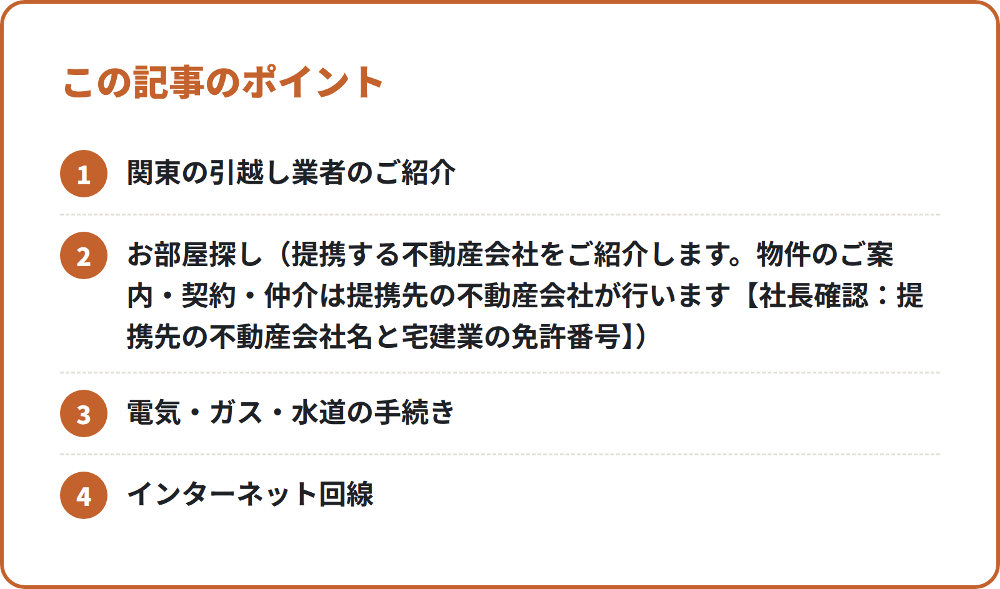

<!-- 状態：校正待ち（ライター：サヤ・10/1）／アカウント：A11／価格：無料
     制度確認：済（ジン・10/1）＋直した点：①「2026年1月の発表のタイトルは〜でした」は日付が検索結果1件だけなので、日付を書かず「毎年の発表のタイトルで約2倍と案内」に直した（平成31年〜令和5年の各発表で同じタイトルを確認） ②「動かせない人も心配はいりません／選べる枠はまだ残っています」は根拠のない約束なので削除し、事実の手順だけにした ③附帯サービスの費用は「見積書に書かれたものに限り」別に請求される、と約款どおりに直した。解約・延期手数料の割合と「3日前までの確認」の条件は、約款・国民生活センター・運輸局の案内（検索結果）と一致。宅建業法（提携先をご紹介・仲介は提携先）・紹介料の表示は問題なし。原文未確認の出典は社長が公開前に確認
     編集長・ジンへ：国土交通省・国民生活センター・マイナポータル（myna.go.jp）は作業環境から開けず、WebSearch の検索結果の要約で確かめた。確認リストの URL はすべて「原文未確認」
     2026年春の数字は、2026年1月28日の報道発表（検索結果）の言い方に合わせた。2027年春の発表が出たら差し替える
     N015 と重ならないよう、キャンセル料は「3月に予定が動いたとき」の場面に絞った。他社の料金・相場は書いていない -->

# 3月の引越しで慌てないために：国交省の混雑予想・キャンセル料のルール・マイナポータルの転出届

**こんな人向け：** 1〜3月に関東で引越す予定の人。辞令や入学の日程で、引越しの日がまだ動くかもしれない人。役所の手続きを、できるだけ窓口に行かずに済ませたい人。

**この記事で分かること：** 国土交通省が毎年出している、春の引越しの混雑についての呼びかけ。予定が変わったときのキャンセル料・延期の手数料のルール。マイナポータルで転出届を出すときの流れと期限。

**結論：** 3月の引越しは、日にちが決まった時点で業者の予約を入れます。予定が動きそうなら、**引越しの日の3日前より前に**業者へ連絡します。別の市区町村へ引越す人は、マイナンバーカードがあればマイナポータルで転出届を出せます。ただし**転入届は、新しい住所の役所の窓口で出します**。

---

## 1. 国土交通省の呼びかけ：3月は通常の月の約2倍

国土交通省は毎年、春の引越しシーズンの前に「引越時期の分散に御協力をお願いします！」という報道発表を出しています。発表のタイトルでは「3月の引越件数は通常月の約2倍！混雑時期を外してスムーズな引越を」と案内しています（出典は最後の確認リスト）。

発表では、3〜4月に依頼が集中するとして、経済団体などを通じて利用者に時期の分散を呼びかけています。時期をずらした利用者の声として、次のような例も紹介されています。

- 3月末の土日の引越しと比べて、引越し代金が安くなった
- 会社の従業員の引越しにかかるコストを抑えられた
- 3月の最終週からずらしたことで、予約が取りやすくなった

日にちを自分で選べる人は、**3月の最終週と土日を外せるか**を、最初に考えてみてください。動かせない人は、日にちが決まった時点で、できるだけ早く予約を入れます。

### 日にちが動かせない人がやること
- 引越しの日が決まった日のうちに、複数の業者に見積もりを頼む
- 候補日を第1〜第3まで出し、「この日ならいくらか」を聞く
- 午前・午後・時間指定なしで、どれが空いているかも聞く

見積もりの取り方の詳しいことは、別の記事「関東の引越し：見積もりの取り方と、費用をおさえる時期・コツ」にまとめています。

## 2. 3月は予定が動きやすい：キャンセル料のルール

春の引越しは、辞令の日、入学の手続き、新居の入居日などで、予定が後から動くことがあります。だから契約の前に、**キャンセルや延期をしたときの手数料**を知っておくと安心です。

### 標準引越運送約款での決まり
引越しの契約のルールとして、国土交通省が定めた「標準引越運送約款」があります。国民生活センターの解説などによると、お客さんの都合で解約・延期をするときの手数料は、次のようになっています。

| 連絡した日 | 解約・延期の手数料 |
|---|---|
| 引越しの日の3日前まで | かからない |
| 2日前 | 見積書の運賃と料金の20％以内 |
| 前日 | 30％以内 |
| 当日 | 50％以内 |

さらに、手数料を請求できるのは、**業者が荷物の受け取りの日の3日前までに、見積書の内容に変更がないかを確かめた場合に限る**とされています。

### 気をつけたい2つのこと
1. **手数料とは別の費用がかかることがある**：業者がすでに始めた附帯サービス（段ボールの配達、エアコンの取り外しなど）にかかった費用は、見積書に書かれたものに限り、手数料とは別に請求されることがあります
2. **約款は契約する会社のものを読む**：業者が独自の約款を使っている場合もあります。見積書と約款の「解約手数料」の欄を、契約の前に確かめてください

### 予定が動きそうなときの進め方
- 辞令や入居日が確定しそうな日を、見積もりのときに業者へ伝えておく
- 変わりそうだと分かったら、確定を待たずに**3日前より前に**一度相談する
- 延期の場合は、新しい日の空きをその場で聞く（3月は枠が埋まりやすいため）

### たとえば、こんなとき
3月20日に引越しの予約をしていて、辞令で日にちが1週間後ろにずれそうだと分かったとします。

- 3月16日の時点で分かったなら、3日前より前なので、約款の上では延期の手数料はかかりません
- 3月19日（前日）に連絡すると、約款の上では30％以内の手数料がかかることがあります

同じ延期でも、連絡の日で負担が変わります。「まだ決まっていないけれど、ずれるかもしれない」という段階で、一度業者に伝えておくのが安心です。

話がまとまらないときは、消費者ホットライン「188」で近くの消費生活センターなどの窓口を案内してもらえます。

## 3. マイナポータルの転出届：窓口に行く回数を減らす

別の市区町村へ引越す人は、今の住所の役所に転出届を出します。マイナンバーカードがあれば、デジタル庁の「引越し手続オンラインサービス（引越しワンストップサービス）」を使って、マイナポータルから**転出届の提出と、新しい住所の役所に行く日（来庁予定日）の連絡**ができます。この場合、今の住所の役所の窓口に行くのは原則不要です。

### 使うときの流れ
1. マイナポータルで、引越す日・新しい住所・引越す人・来庁予定日などを入力する
2. マイナンバーカードで本人確認をして、転出届を出す
3. 引越したあと、新しい住所の役所の窓口に行き、転入届を出す（マイナンバーカードを持って行く）

### 期限で気をつけること
- オンラインで転出届を出せる時期は、自治体の案内で「引越し予定日の30日前から、引越した日から10日後まで」とされている例があります。**住んでいる自治体のページで確かめて**ください
- 転入届は、住民基本台帳法で**新しい住所に住み始めてから14日以内**に出すことになっています。オンラインの転出届を使った場合は、自治体の案内で「転出予定日から30日以内」という期限も示されています
- 転入届の窓口には、引越す人のマイナンバーカードを全員分持って行きます

来庁予定日は、引越しの日から無理のない日を選んでおくと、転入届の14日以内に収めやすくなります。同じ市区町村の中で引越す人は、転出届はいりません（引越してから転居届を出します）。

## チェックリスト：3月の引越しの前に

- [ ] 3月の最終週・土日を外せるか考えた
- [ ] 日にちが決まった日に、複数の業者に見積もりを頼んだ
- [ ] 見積書と約款の「解約手数料」の欄を読んだ
- [ ] 予定が動きそうなら、引越しの日の3日前より前に相談すると決めた
- [ ] 附帯サービス（段ボール・エアコンなど）を頼む日を確かめた
- [ ] 自治体のページで、オンラインの転出届を出せる時期を確かめた
- [ ] マイナポータルで転出届を出し、来庁予定日を選んだ
- [ ] 転入届を出す日を、住み始めてから14日以内で予定に入れた
- [ ] 転入届の日に、全員分のマイナンバーカードを持って行く

## よくある失敗

**1. 辞令が出るまで業者に連絡しない**
確定を待つうちに、3月の希望の日が埋まってしまう例です。候補日のまま見積もりを取り、変わりそうなら3日前より前に相談します。

**2. キャンセルの手数料だけ見て、附帯サービスの費用を見落とす**
段ボールの配達や工事をすでに頼んでいると、その費用は別にかかることがあります。頼んだ作業の一覧を見積書で確かめておきます。

**3. オンラインで転出届を出して、転入届も済んだと思ってしまう**
マイナポータルでできるのは、転出届と来庁予定日の連絡です。転入届は、新しい住所の役所の窓口で出します。

---

## 引越しのこと、まとめて相談できます

3月の引越しで「どの業者に頼めばいいか分からない」「見積もりを取る時間がない」という方には、筆者の会社が関東の引越し業者をご紹介しています。

<!-- 画像：ポイント -->

筆者の会社では、引越しにまつわる次のご相談をまとめて受けています。
- 関東の引越し業者のご紹介
- お部屋探し（提携する不動産会社をご紹介します。物件のご案内・契約・仲介は提携先の不動産会社が行います【社長確認：提携先の不動産会社名と宅建業の免許番号】）
- 電気・ガス・水道の手続き
- インターネット回線
- ウォーターサーバー

※紹介するサービスによって、当社が紹介料を受け取る場合があります。【社長確認：書き方】

▶ [引越しの無料相談フォーム](https://【社長確認：引越し相談フォームのURL】?src=N021)

---

## 確認リスト（公開前に消す）

**出典（すべて検索結果の要約で確認。公式ページの本文は作業環境から開けず＝原文未確認。ジンが原文で確かめる）**
- 国土交通省 報道発表「引越時期の分散に御協力をお願いします！～3月の引越件数は通常月の約2倍！～」（2026年1月28日とする検索結果）https://www.mlit.go.jp/report/press/jidosha04_hh_000324.html ：3〜4月に依頼が集中、利用者の声3つ【原文未確認】
- （ジン・10/1）2026年1月28日という日付は検索結果1件だけのため本文に書かない。タイトルの「約2倍」は平成31年・令和2年・令和4年・令和5年の発表 PDF で同じであることを検索結果で確認（例：https://www.mlit.go.jp/report/press/content/001582861.pdf ）。利用者の声3つは「引越時期の分散に向けたお願い」ページの要約で同じ言い方を確認【原文未確認】
- （ジン・10/1）解約手数料の割合・3日前までの確認・附帯サービス（見積書に明記したものに限る）は、約款の告示・国民生活センター・近畿運輸局 Q&A https://wwwtb.mlit.go.jp/kinki/hikosi/q-a.html の検索結果で一致を確認【原文未確認】
- 同 令和3年1月の発表（articles.csv のメモの URL）https://www.mlit.go.jp/report/press/jidosha04_hh_000226.html 【原文未確認】
- 国土交通省「引越時期の分散に向けたお願い」https://www.mlit.go.jp/jidosha/jidosha_fr4_000022.html 【原文未確認】
- 国民生活センター「引っ越しのキャンセル料が高い！」https://www.kokusen.go.jp/t_box/data/t_box-faq_qa2018_23.html ：3日前まで無料／2日前20％以内／前日30％以内／当日50％以内、3日前までの確認をした場合に限り請求、附帯サービスの費用は別に請求される場合あり【原文未確認】
- 標準引越運送約款（国土交通省告示）https://www.mlit.go.jp/notice/noticedata/sgml/1990/68227000/68227000.html 【原文未確認】
- デジタル庁 引越しワンストップサービスのチラシ https://www.digital.go.jp/assets/contents/node/basic_page/field_ref_resources/7b66d7ba-7184-49c0-bca1-5e249046a3f5/c458aeb4/20241223_policies_moving_onestop_service_leaflet.pdf ：転出届と来庁予約をオンラインで【原文未確認】
- デジタル庁ニュース「役所に行かずに転出届が出せる！引越し手続オンラインサービス」https://digital-agency-news.digital.go.jp/articles/2025-02-06 【原文未確認】
- マイナポータル 引越しワンストップサービス https://myna.go.jp/html/moving_oss.html 【原文未確認】
- 千葉市「マイナポータルを利用したオンライン申請（転出届）」https://www.city.chiba.jp/shimin/shimin/kusei/tensyutsu_mn.html ／葛飾区 https://www.city.katsushika.lg.jp/kurashi/1000046/1001401/1030654.html ：オンラインの転出は引越し予定日の30日前から引越し後10日まで、転入は住み始めて14日以内かつ転出予定日から30日以内、マイナンバーカード全員分を持参【原文未確認】（本文は「自治体の案内の例」として書いた）
- 消費者ホットライン188（消費者庁）https://www.caa.go.jp/policies/policy/local_cooperation/local_consumer_administration/hotline/ 【原文未確認】

**ジンに確かめてほしいこと**
- [ ] 解約・延期手数料の割合と「3日前までの確認」の条件が約款の条文どおりか
- [ ] 2026年1月の報道発表の日付とタイトル、利用者の声の言い方
- [ ] オンラインの転出届を出せる時期（自治体ごとの違いがあるか）

**【社長確認】**
- 提携先の不動産会社名と宅建業の免許番号
- 紹介料についての書き方
- 引越し相談フォームの URL

**点検（moving/review.md）**
- [x] 役所の手続き・期限・約款は公式の出典つき（原文未確認はジンが確認）
- [x] 「仲介手数料無料」は書いていない（該当なし）
- [x] 物件の紹介は「提携する不動産会社をご紹介」、会社名・免許番号は【社長確認】
- [x] 他社の料金・相場を書いていない
- [x] 締めあり（筆者の会社が紹介していること・紹介料を受け取る場合があること）
- [x] フォームのリンクに ?src=N021
- [x] ng-words なし。不安をあおっていない
- [x] チェックリストあり
- [x] 制度確認：済（ジン・10/1）
