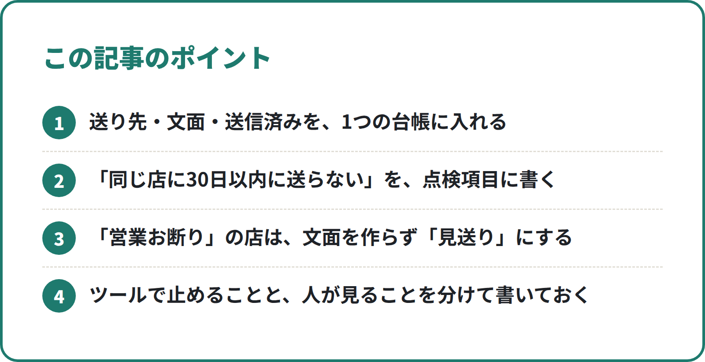
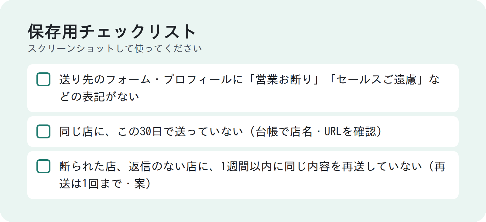

<!-- 状態：校正待ち（ライター：タロ・10/3）／アカウント：A02／価格：1,480円
     編集長へ：材料は callcenter/ の実物だけ（sales/review.md・.claude/agents/appointer.md・sv.md・list-extractor.md・tools/send_assist.py・sender.yaml.example）。
     send_assist.py が自動で止めるのは「承認済以外は出さない」「フォームの営業お断り表記」「1日の上限」だけ。30日以内の重複は、リスト係・AP・SV が台帳で確かめる運用として書いた。「自動で防ぐ」とは書いていない
     送信数・返信率・二重送信の件数など営業部の実数は入れていない。1日の上限の値（sender.yaml.example の初期値）も書いていない
     「再送は1回まで・1週間以内に再送しない」は sales/review.md で「案」の扱いなので、本文でも案として書いた
     【社長確認】は入れていない。根拠メモの listoru.com・lead-dynamics.com は業者の記事なので本文には使っていない（悩みの確認だけ）
     N005（点検）・N017（現場の流れ）と重ならないよう「二重送信・お断り」に絞った。画像は build_note_images.py で作る -->

# 10人で送っても同じ店に二度送らない：送信台帳を1つにして「30日ルール」と「お断り表記は見送り」で守る仕組み

**こんな人向け：** 複数の人や AI でフォーム営業をしている営業責任者。人数を増やしたら、同じ店に二度送ってしまわないか心配な人。

**この記事でできること：** 二重送信と「営業お断り」の店への送信を、台帳1つと点検の順番で防ぐ仕組みが分かります。ツールで止めることと、人が見ることの分け方も分かります。

**筆者がやったこと：** MEO対策ツールの営業で、Claude Code を使って営業部を作りました。AP（アポインター＝文面を作る役）10人が、並んで文面を作っています。送信は人が行います。

---

## 人を増やすと、なぜ二重送信が起きるのか

1人で送っているうちは、自分の記憶で防げます。
「この店には先週送った」と覚えているからです。

人や AI を増やすと、この記憶が分かれます。

- Aさんの一覧と、Bさんの一覧が別になっている
- 同じ店が、別のリストに別の名前で入っている
- 送ったかどうかを、送った本人しか知らない

二重送信は、だれか1人の不注意ではありません。
**「送った記録」が1か所にないこと**が原因です。

## 結論：台帳を1つにして、「だれが・いつ見るか」を決める

私たちの営業部は、送り先も文面も送信済みも、1つの台帳に入れています。
そのうえで、確かめる係と順番を決めています。

| 確かめること | どう止めるか |
|---|---|
| 「営業お断り」の表記 | 人と AI が確かめる。送信補助ツールも、フォームの表記を見つけたら入力しない |
| 1日に送る数 | 送信補助ツールが、上限で止まる |
| 30日以内に同じ店へ送っていないか | **人（AP・SV）が台帳で確かめる。ツールでは止めていない** |

正直に書くと、30日の重複は自動では止めていません。
台帳を見る人と順番を決めて、人の目で防いでいます。

「ツールで全部ブロック」の前に、やることがあります。
**台帳を1つにして、だれが見るかを決めること**です。
ツールを入れても、記録が分かれていれば重複は防げません。

<!-- 画像：ポイント -->


**無料部分のまとめ（ここだけでも使えます）**
- 送り先・文面・送信済みを、1つの台帳に入れる
- 「同じ店に30日以内に送らない」を、点検項目に書く
- 「営業お断り」の店は、文面を作らず「見送り」にする
- ツールで止めることと、人が見ることを分けて書いておく

### 有料部分の目次
1. 台帳1つの作り方（列と状態）
2. 30日ルール：だれが、いつ台帳を見るか
3. 「営業お断り」を何度も見る理由
4. 送信補助ツールが止めること・止めないこと
5. 1日の上限を決める
6. 断られた店・返信のない店への再送（案）
7. コピーして使える点検項目と指示文
8. つまずきやすい点と直し方
9. 保存用チェックリスト

--- ここから有料 ---

## 1. 台帳1つの作り方

台帳は、CSV（表計算で開ける表）1つです。
私たちは outbox.csv という名前にしています。

列はこうしています。

```
ID,店名,送る手段,送り先URL,件名,本文,AP,SV,状態,作成日,送信日時,返信日時,メモ
```

大事なのは、**文面の下書きの段階から、この台帳に入れる**ことです。
送ったものだけを記録すると、作りかけの重複に気づけません。

状態は、次のように進みます。

```
下書き → 承認済／差し戻し → 送信済 → 返信あり
（お断り表記などで送らない店は「見送り」）
```

「見送り」も消さずに残します。
消すと、次の人がまた同じ店に文面を作るからです。

**ポイント：** 状態を変えられる人を分けています。
AP は「下書き」まで。「承認済」は SV だけ。「送信済」は送った人だけです。

## 2. 30日ルール：だれが、いつ台帳を見るか

点検リストには、この1行を入れています。

```
- [ ] 同じ店に、この30日で送っていない（outbox.csv で店名・URLを確認）
```

この確認は、3つの場面で行います。

1. **リストに入れるとき（リスト係）**
   送り先リストと台帳を見て、すでにある店・送信済みの店を除く。店名と住所、フォームの URL、Instagram で照らし合わせる
2. **文面を作る前（AP）**
   台帳で、同じ店に30日以内に送っていないか確かめる
3. **点検のとき（SV）**
   点検リストの1行として、もう一度確かめる

同じことを3回見るのは、むだに見えます。
でも、1か所で見落としても、次で止まります。

**ここは自動ではありません。**
送信補助ツールは、30日以内かどうかを見ていません。
だから「最後はツールが止めてくれる」と考えないことが大事です。

### 30日は、決まった正解ではない

30日は、私たちが決めた間隔です。
業界や商材で、ちょうどよい間隔は変わります。

決めるときは、次の2つを考えます。

- 相手が「またこの会社か」と感じない長さか
- 断られた店や返信のない店を、どう扱うか（6章）

## 3. 「営業お断り」を何度も見る理由

フォームのページに「営業のご連絡はご遠慮ください」とある店があります。
私たちは、この表記がある店には送りません。

この確認も、何度も行います。

1. **リスト係**：表記がある店は、リストに入れない
2. **AP**：送り先のページを開いて確かめる。表記があれば、文面を作らず「見送り」にし、メモに理由を書く
3. **SV**：AP の報告をうのみにせず、自分でもページを開いて確かめる
4. **送信補助ツール**：フォームを開いたとき、表記を見つけたら入力しない

何度も見る理由は、表記の場所がばらばらだからです。
フォームの上にある店も、ページのいちばん下にある店もあります。

**ポイント：** 「お断り」の店は、文面を作る前に止めます。
作ってから捨てるより、作らないほうが手間も事故も少ないからです。

## 4. 送信補助ツールが止めること・止めないこと

人がフォームに毎回入力するのは大変です。
そこで、送信を手伝うツール（send_assist.py）を作りました。

ツールが**止めること**は、次の3つです。

- **「承認済」以外は出さない。** 下書き・差し戻し・見送りの文面は、送る画面に出てこない
- **フォームに「営業お断り」の表記があれば、入力しない。** 状態を「見送り」にし、見つけた表記をメモに残す
- **1日の上限を超えたら、止まる**

ツールが**止めないこと**も、はっきり書いておきます。

- **30日以内に同じ店へ送っていないか**は、見ていない
- 送信ボタンは押さない。最後は人が文面を見て押す

お断り表記は、決まった言い方を探して見つけます。
「営業」「セールス」「勧誘」「売り込み」のあとに、「お断り」「ご遠慮」「禁止」などが続く書き方です。

言い方が違えば、ツールは見つけられません。
**だから、ツールの前に人が見る**順番にしています。

### 送ったら、すぐ台帳に書く

人が送ったら、ツールが台帳の状態を「送信済」にします。
送った日時も、同じ行に入れます。

ここがずれると、二重送信が起きます。
「あとでまとめて記録」にしないことが大事です。

## 5. 1日の上限を決める

送信補助ツールは、設定ファイルに書いた上限で止まります。
今日「送信済」になった数を台帳から数えて、上限に達したら止まります。

上限の数は、自社で決めてください。
決めるときは、人がきちんと文面を見て押せる数にします。

**ポイント：** 上限は、二重送信の対策にもなります。
急いで大量に送る日をなくすと、確かめる時間が残るからです。

## 6. 断られた店・返信のない店への再送（案）

いま、次の項目を点検リストの「案」として出しています。
まだ正式な項目ではありません。

```
- [ ] 断られた店、返信のない店に、1週間以内に同じ内容を再送していない（再送は1回まで）
```

30日ルールは「同じ店に続けて送らない」決まりです。
こちらは「何回まで送るか」の決まりです。

台帳の状態とメモに、断られたことを残しておきます。
残していないと、30日たったあとに、また送ってしまいます。

## 7. コピーして使える点検項目と指示文

### 点検リスト（重複・お断りの部分だけ）

```
- [ ] 送り先のフォーム・プロフィールに「営業お断り」「セールスご遠慮」などの表記がない
- [ ] 同じ店に、この30日で送っていない（台帳で店名・URLを確認）
- [ ] 断られた店、返信のない店に、1週間以内に同じ内容を再送していない（再送は1回まで・案）
```

### 文面を作る係（AP）への指示（該当の部分）

Claude Code のサブエージェントに渡している指示の、重複とお断りの部分です。
ファイル名は自社に合わせて書き換えてください。

```
2. 送り先のページを確かめる。「営業お断り」などの表記があれば、文面を作らず 状態=見送り・メモに理由
3. 台帳（outbox.csv）で、同じ店に30日以内に送っていないか確かめる
4. 店ごとの文面を作る。店について書くのは確かめたことだけ
5. 台帳に1行追加：ID,店名,送る手段,送り先URL,件名,本文,AP,SV,状態=下書き,作成日
```

### 点検する係（SV）への指示（該当の部分）

```
1. 台帳の自チームの「下書き」を、点検リストで1件ずつ点検
   - 全部OK → 状態を「承認済」
   - ✗ がある → 「差し戻し」にし、メモに理由（どの項目か）
2. 送り先ページの「営業お断り」表記は、自分でもページを開いて確かめる
```

**書き換えるときの注意**
- 文面を作る係に、送信の手段を持たせない
- 「台帳を見る」を、作る係と点検する係の両方に書く
- 台帳のファイルは1つだけ。チームごと・人ごとに分けない

## 8. つまずきやすい点と直し方

- **台帳がチームごとに分かれている** → 1つにまとめる。チームは「AP」「SV」の列で分ける
- **同じ店が別の名前で入る** → 店名だけで照らし合わせない。住所・フォームの URL・Instagram でも見る
- **フォームと Instagram で別の店扱いになる** → 送る手段が違っても、同じ店は同じ店として数える
- **「見送り」の行を消してしまう** → 消さない。次の人への目印になる
- **送ったあとの記録が遅れる** → 送った直後に「送信済」にする。まとめて記録しない
- **ツールがあるから大丈夫と思う** → ツールが止めないこと（30日の重複）を、指示と点検リストに書いておく

## 9. 保存用チェックリスト

<!-- 画像：チェックリスト -->


```
- [ ] 送り先・下書き・送信済みを、1つの台帳に入れている
- [ ] リストに入れる前に、台帳と照らし合わせている
- [ ] 文面を作る前に、30日以内に送っていないか確かめている
- [ ] 点検でも、30日以内の重複を確かめている
- [ ] 「営業お断り」の店は、文面を作らず「見送り」にしている
- [ ] 点検する係も、自分でページを開いて表記を確かめている
- [ ] 「見送り」の行を消さずに残している
- [ ] 送った直後に、台帳を「送信済」にしている
- [ ] 1日の上限を決めている
- [ ] ツールが止めないことを、指示と点検リストに書いている
```

---

質問はコメントでどうぞ。
