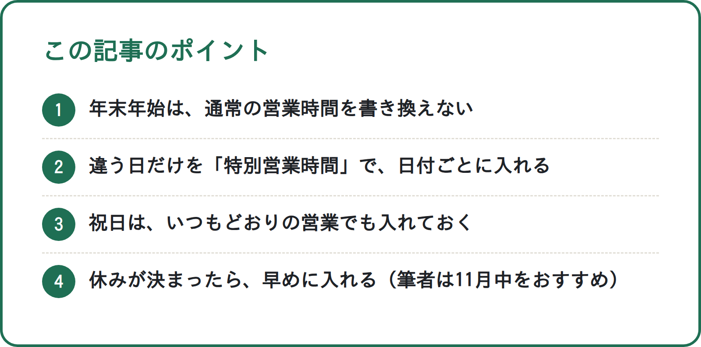
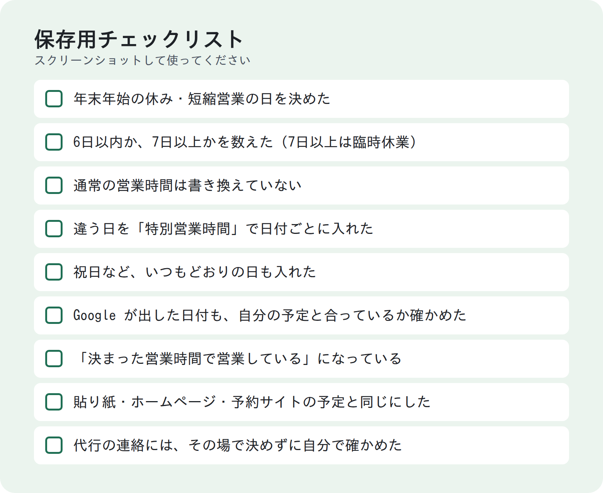

<!-- 状態：校正待ち（ライター：ハナ・10/3）／アカウント：A03／価格：980円
     編集長へ：Google の説明は、公式ヘルプ「特別営業時間を設定する方法」（answer/6303076）の内容だけで書いた。この環境から support.google.com を開けず（接続がブロック）、WebSearch の要約でしか確かめていない。公開前に原文と照合する（末尾の一覧）
     「7日以上・期間未定は臨時休業マーク」は検索の要約で 6303076 の説明として出たもの。原文で、このページの説明か別ページかを確かめる
     「年末年始の分は11月のうちに」は Google のヘルプにはない。民間サイトの見方（根拠なし）なので、本文では筆者の考え（推測）として書いた。民間サイトは本文に使っていない
     10/2 決定⑥どおり「業者の営業を見分ける・断る」立場で書いた。筆者が MEO ツールを扱う会社にいることは前半に明記
     MEO の無料相談フォームの案内は入れていない（URL がまだないため。templates.md の「A03 の締め」とは違う。URL が決まったら足すか編集長が判断）
     数字（来店・表示回数など）は入れていない。社長確認の空欄は入れていない。N018・N102 への言及もしていない（未公開のため）。画像は build_note_images.py で作成済み（header・points・checklist） -->

# 年末年始の営業時間は11月のうちに：Googleマップの「特別営業時間」の入れ方と、通常の営業時間を書き換えないほうがよい理由

**こんな人向け：** 美容室・整骨院・飲食店などの店長やオーナー。
年末年始の休みを、Googleマップにどう入れるか分からない人。

**この記事でできること：** 「いつもと違う日」だけを入れる方法が分かります。
使うのは、Google の「特別営業時間」です。

通常の営業時間を書き換えないほうがよい理由も分かります。

**筆者について：** 店舗向けに MEO のツールを案内する会社にいます。
MEO は、Googleマップでお店を見つけてもらう工夫のことです。

この記事では、業者に頼まなくても、お店の人が自分でできることを書きます。

---

## 年末年始、マップの営業時間で困ること

年末年始は、休む日や短く営業する日が出ます。
でも Googleマップには、いつもの営業時間が出たままになりがちです。

お客さんから見ると、こうなります。

- マップで「営業中」と出ていたのに、行ったら閉まっていた
- 休みだと思って来なかったのに、実は開いていた

どちらも、お客さんは悪くありません。
マップの情報を信じて動いただけです。

## 結論：通常の営業時間は変えず、「特別営業時間」で日付ごとに入れる

Google の公式ヘルプに、「特別営業時間」という設定があります。
祝休日やイベントなど、一時的に営業時間が変わる日のための設定です。

出典：[特別営業時間を設定する方法](https://support.google.com/business/answer/6303076?hl=ja)

ポイントは3つです。

1. **いつもの営業時間はそのまま。** 違う日だけを、日付ごとに入れる
2. **休む日は「休業」、短くする日は時間を入れる**
3. **祝日は、いつもどおり営業する日でも入れる。** 公式ヘルプでは、通常と同じでも設定することがすすめられています

### いつまでに入れるか（筆者の考え）

Google のヘルプに、「何日前までに」という決まりは見当たりません。
（筆者が確かめた範囲です）

筆者は、年末年始の分は**11月のうちに入れておく**のがよいと考えています。

理由は、12月はお店が忙しく、後回しになりやすいからです。
休みの日が決まったら、その日のうちに入れるのがおすすめです。

これは筆者の考え（推測）で、Google が決めた期限ではありません。

<!-- 画像：ポイント -->


**無料部分のまとめ（ここだけでも使えます）**
- 年末年始は、通常の営業時間を書き換えない
- 違う日だけを「特別営業時間」で、日付ごとに入れる
- 祝日は、いつもどおりの営業でも入れておく
- 休みが決まったら、早めに入れる（筆者は11月中をおすすめ）

### 有料部分の目次
1. 特別営業時間の入れ方（手順）
2. 年末年始の入れ方の例（休む日・短くする日・いつもどおりの日）
3. 長く休むときは「臨時休業」を使う
4. 特別営業時間が出ないときに確かめること
5. 通常の営業時間を書き換えないほうがよい理由
6. 11月に書き込んでおく年末年始の表
7. この時期の「営業時間の代行」の連絡の見分け方・断り方
8. 保存用チェックリスト

--- ここから有料 ---

## 1. 特別営業時間の入れ方

公式ヘルプ（[特別営業時間を設定する方法](https://support.google.com/business/answer/6303076?hl=ja)）で案内されている流れです。
画面の言葉は変わることがあるので、公式ヘルプも一緒に見てください。

1. 自分のお店のビジネス プロフィールを開く
2. 「プロフィールを編集」→「営業時間」を選ぶ
3. 「特別営業時間」の横の編集（えんぴつの印）を押す
4. 日付を選ぶ。Google が出す日付を確かめるか、新しい日付を足す
5. その日の営業時間を入れる（下の表）
6. 保存する

| その日 | 入れ方 |
|---|---|
| 営業する（時間が違う） | 「休業」のチェックを外し、開始と終了の時間を入れる |
| 休む | 「休業」にチェックを入れる |

**ポイント：** Google が祝日などの日付を出してくれることがあります。
出てきた日付も、自分のお店の予定と合っているか1つずつ確かめます。

## 2. 年末年始の入れ方の例

年末年始は、日によって入れ方が変わります。
自分のお店の予定に置きかえて使ってください。

| 日付の例 | お店の予定 | 特別営業時間の入れ方 |
|---|---|---|
| 12月30日 | 短くする | 「休業」を外し、短い時間を入れる |
| 12月31日 | 休む | 「休業」にチェック |
| 1月1日 | 休む | 「休業」にチェック |
| 1月2日 | 休む | 「休業」にチェック |
| 1月3日 | 休む | 「休業」にチェック |
| 1月4日 | いつもどおり | いつもの時間をそのまま入れる |

いつもどおりの日も入れると、「本当に開いている」と伝わります。
公式ヘルプでも、祝日は通常と同じでも入れるようすすめています。

**注意：** 上の日付は、入れ方の例です。
休みの日は、お店ごとに決めてください。

## 3. 長く休むときは「臨時休業」を使う

公式ヘルプでは、特別営業時間は**連続して最長6日間の休業**までの設定です。

7日以上続けて休むとき、いつまで休むか未定のときは違います。
「臨時休業」のマークを付けるよう案内されています。

| 休む長さ | 使う設定 |
|---|---|
| 6日以内 | 特別営業時間（日付ごとに「休業」） |
| 7日以上・いつまでか未定 | 臨時休業 |

年末年始に長めに休むお店は、休む日数を先に数えてから選んでください。

## 4. 特別営業時間が出ないときに確かめること

特別営業時間を出すには、営業時間の設定に条件があります。
**「決まった営業時間で営業している」**を選んでおく必要がある、と公式ヘルプにあります。

入れたのに出ないときは、まずここを確かめます。

1. 「プロフィールを編集」→「営業時間」を開く
2. 「決まった営業時間で営業している」になっているか見る
3. なっていなければ選び、いつもの営業時間を入れる

## 5. 通常の営業時間を書き換えないほうがよい理由

年末年始だけのために、いつもの営業時間を書き換えるお店もあります。
筆者は、これはおすすめしません。

理由は、次の3つです（公式ヘルプの説明をもとにした、筆者の考えです）。

- **戻し忘れる。** 年が明けて忙しいと、元に戻すのを忘れやすい。戻し忘れると、1月からずっと違う時間が出る
- **日付ごとに入れられない。** いつもの営業時間は曜日ごとの設定。「12月31日だけ休み」は、特別営業時間のほうが入れやすい
- **Google の説明に合っている。** 公式ヘルプでは、一時的な変更には特別営業時間を使うと案内されている

特別営業時間は、日付ごとの設定です。
いつもの営業時間には手を付けないので、あとで戻す作業がいりません。

## 6. 11月に書き込んでおく年末年始の表

休みの予定が決まったら、この表を埋めてから入力すると迷いません。
紙に書いても、スマホのメモに写しても使えます。

```
| 日付 | 営業する／休む | 営業時間（営業する日だけ） | Googleに入れた |
|------|---------------|--------------------------|---------------|
| 12/  |               |                          |               |
| 12/  |               |                          |               |
| 12/  |               |                          |               |
| 1/   |               |                          |               |
| 1/   |               |                          |               |
| 1/   |               |                          |               |
```

**ポイント：** 「Googleに入れた」の列に印を付けます。
入れ忘れの日が、ひと目で分かります。

あわせて、貼り紙・ホームページ・予約サイトの予定も見くらべます。

場所によって予定が違うと、お客さんがどれを信じていいか迷うからです。

## 7. この時期の「営業時間の代行」の連絡の見分け方・断り方

「営業時間の設定を代わりにやります」という連絡が来たときの話です。
筆者も MEO のツールを扱う側ですが、だからこそ書いておきます。

**特別営業時間は、お店の人が自分の管理画面から入れられます。**
手順は、この記事の1章と公式ヘルプにあるとおりです。

### 見分けるときに見るところ

- 「入れないと表示されなくなる」など、不安をあおる言い方をしていないか
- その場で契約や支払いを決めさせようとしていないか
- 何をするのか、自分で確かめられる説明があるか

当てはまるときは、その場で決めずに、まず自分の管理画面を開いて確かめてください。

### 断るときの一言（そのまま使えます）

```
営業時間は自分で設定しますので、今回はけっこうです。
今後のご連絡も不要です。
```

フォームやメールなら、この2行を返すだけで大丈夫です。
理由をくわしく説明する必要はありません。

## 8. 保存用チェックリスト

<!-- 画像：チェックリスト -->


```
- [ ] 年末年始の休み・短縮営業の日を決めた
- [ ] 6日以内か、7日以上かを数えた（7日以上は臨時休業）
- [ ] 通常の営業時間は書き換えていない
- [ ] 違う日を「特別営業時間」で日付ごとに入れた
- [ ] 祝日など、いつもどおりの日も入れた
- [ ] Google が出した日付も、自分の予定と合っているか確かめた
- [ ] 「決まった営業時間で営業している」になっている
- [ ] 貼り紙・ホームページ・予約サイトの予定と同じにした
- [ ] 代行の連絡には、その場で決めずに自分で確かめた
```

---

質問はコメントでどうぞ。

---

### 公開前に原文を確認する Google ヘルプ
**原文未確認**（この環境から support.google.com を開けず、WebSearch の検索結果の要約でしか確かめていない）
- 特別営業時間を設定する方法：https://support.google.com/business/answer/6303076?hl=ja（原文未確認）
  - 確かめること：手順（プロフィールを編集 → 営業時間 → 特別営業時間の横の編集 → 日付 → 休業／時間）・画面の言葉
  - 確かめること：「連続して最長6日間の休業まで」「7日以上・期間未定は臨時休業マーク」がこのページの説明か
  - 確かめること：「祝日は通常と同じでも設定をすすめる」
  - 確かめること：「表示には『決まった営業時間で営業している』が必要」
  - 確かめること：「いつまでに入れる」の記載がないこと（本文の「11月中」は筆者の推測として書いた）
（この一覧は公開前に消す）
