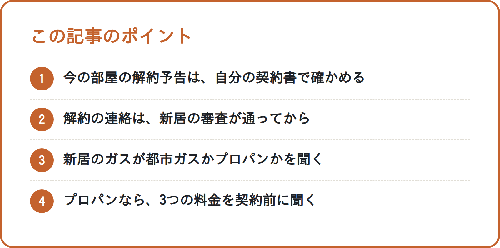

<!-- 状態：校正待ち（ライター：アオイ・10/2）／アカウント：A11／価格：無料
     制度確認：未（ジンの点検待ち）
     編集長・ジンへ：国土交通省・消費者庁・経済産業省のページは作業環境から開けず、WebSearch の検索結果の要約で確かめた（確認リストはすべて「原文未確認」）
     解約予告は「標準契約書（ひな形）では少なくとも30日前。実際は自分の契約書で決まる」と書き、30日と言い切っていない。プロパンの料金の数字・相場、「プロパンは高い」などの比べ方は書いていない
     「10月中旬以降は条件を比べやすい」は出典が民間の不動産サイトだけなので使っていない
     N019（秋冬の段取り・退去の費用）と重ならないよう、「申し込む前の2つの確認」（解約予告・ガスの種類と料金）に絞った
     仲介手数料無料は、10/1 社長了承どおり締めのお部屋探しの案内で「条件は物件によって違うため、ご相談のときにご説明します」とセットで書いた -->

# 秋に部屋を決める前に：今の部屋の解約予告と、新居のガス（プロパン）料金を契約前に確かめる方法

**こんな人向け：** 10〜11月に関東で部屋を探している人。年内に引越したい人。

**この記事で分かること：** 今の部屋の解約予告の確かめ方。新居のガスがプロパンのとき、契約前に聞くこと。

**結論：** 申し込む前に、今の部屋の契約書で解約の予告期間を見ます。新居がプロパンガスなら、契約の前に料金を聞いておきます。

---

## なぜ「決める前」に確かめるのか

部屋を決めると、2つの話が一気に動きます。今の部屋の解約と、新しい部屋の契約です。

契約のあとに気づいても、直せないことがあります。だから申し込みの前に、2つだけ確かめておきます。

- 今の部屋は、いつまでに解約の連絡が要るか
- 新しい部屋のガスは何か。プロパンなら料金はどうか

どちらも、契約書を見たり、不動産会社に聞いたりすれば確かめられます。申し込みの前に、時間をとっておきます。

## 1. 今の部屋の解約予告を確かめる

### ひな形では「少なくとも30日前」

国土交通省は、賃貸の契約書のひな形を出しています。「賃貸住宅標準契約書」です。

その中では、借主は少なくとも30日前に解約を申し入れる、とされています。30日分の家賃を払えば、すぐに解約できる決まりもあります。

ただ、これはあくまでひな形です。**実際の期限は、あなたの契約書で決まります。**

### 契約書で見るところ

- **解約の予告期間**：何日前か、何か月前か
- **連絡の方法**：電話でよいか、書面が要るか
- **最後の月の家賃**：日割りか、月の分をまるごと払うか
- **特約**：早く出るときの違約金などの決まりがないか

契約書が見つからないときは、管理会社に聞いてみてください。写しをもらえるか、内容を教えてもらえるかを確かめます。

### 解約の連絡は「審査が通ってから」

解約の連絡を先に出すと、困ることがあります。新しい部屋の審査に通らないと、住む部屋がなくなるからです。

審査が通り、契約の日が見えてから連絡します。予告期間から逆算すると、二重の家賃が何日かかるか見通せます。

## 2. 新居のガスがプロパンか確かめる

### なぜ契約の前に聞くのか

ガスが都市ガスかプロパン（LPガス）かは、物件ごとに違います。プロパンの料金は、ガス会社ごとに決まります。

賃貸では、ガス会社を自分で選べないことが多いです。だから、決める前に料金を知っておくと安心です。

消費者庁も、賃貸の契約の前にLPガスの料金を確かめるよう呼びかけています。まずは不動産会社に尋ねてみましょう、と案内しています。

### 2025年4月からのルール

経済産業省のルールが変わり、2025年4月2日から料金の示し方が変わりました。料金は「基本料金・従量料金・設備料金」の3つに分けて示されます。

ガスと関係のない設備の費用は、ガス料金に入れられなくなりました。たとえば、エアコンの費用です。

賃貸向けでは、給湯器などガス器具の費用も入れてはいけない、とされています。こうした設備の費用は、家賃で回収すべきという考え方です。

ただし、この禁止は2025年4月2日以降に結ばれたガスの契約が対象です。それより前からの契約には、当てはまりません。

また2024年7月から、ガス会社は入居を考えている人に、料金を前もって示すよう努めます。入居を考えている人から直接頼まれたときは、応じることになっています。

### 契約の前に聞くこと

- ガスは都市ガスか、プロパンか
- プロパンなら、ガス会社の名前
- 基本料金と、1㎥あたりの料金（従量料金）
- 設備料金があるか。あれば、何の費用か

設備料金の欄に金額があれば、何の費用かを確かめます。聞いた内容は、メモか書面で残しておきます。

料金が高いか安いかは、この記事では決めつけません。気になるときは、同じ条件の物件と比べてみてください。

<!-- 画像：ポイント -->

## この記事のポイント

- 今の部屋の解約予告は、自分の契約書で確かめる
- 解約の連絡は、新居の審査が通ってから
- 新居のガスが都市ガスかプロパンかを聞く
- プロパンなら、3つの料金を契約前に聞く

## チェックリスト：申し込む前に

- [ ] 今の部屋の契約書を出した
- [ ] 解約の予告期間（何日前・何か月前）を確かめた
- [ ] 解約の連絡の方法（電話・書面など）を確かめた
- [ ] 最後の月の家賃が日割りか、月の分かを確かめた
- [ ] 早く出るときの違約金などの特約がないか見た
- [ ] 新居のガスが都市ガスかプロパンかを聞いた
- [ ] プロパンなら、ガス会社の名前を聞いた
- [ ] 基本料金・従量料金・設備料金を聞いて、メモした

## よくある失敗

**1. 「解約は1か月前」と思い込む**

ひな形の30日前を、自分の契約と思い込む例です。

契約書では「2か月前」のこともあります。必ず自分の契約書で確かめます。

**2. 審査の前に解約の連絡を出してしまう**

早く動こうとして、先に解約を伝える例です。審査が通り、契約の日が見えてから連絡します。

**3. ガスの種類を聞かずに契約する**

入居してから、プロパンだったと気づく例です。料金は、契約の前に不動産会社に聞いておきます。

---

## 引越しのこと、まとめて相談できます

秋の部屋探しは、まるっと窓口（筆者の会社）にご相談ください。今の部屋の解約の段取りから、一緒に考えます。

お部屋探しは、提携する不動産会社をご紹介します（物件のご案内・契約・仲介は提携先の不動産会社が行います）【社長確認：提携先の不動産会社名と宅建業の免許番号】

仲介手数料を無料にできる物件もあります。条件は物件によって違うため、ご相談のときにご説明します。

筆者の会社では、引越しにまつわる次のご相談をまとめて受けています。
- お部屋探し（提携する不動産会社をご紹介）
- 電気・ガス・水道の手続き
- インターネット回線（新居で使える回線をご案内）
- ウォーターサーバー
- 関東の引越し業者のご紹介

※紹介するサービスによって、当社が紹介料を受け取る場合があります。【社長確認：書き方】

▶ [引越しの無料相談フォーム](https://【社長確認：引越し相談フォームのURL】?src=N201)

---

## 確認リスト（公開前に消す）

**出典（すべて WebSearch の検索結果の要約で確認。公式ページの本文は作業環境から開けず＝原文未確認。ジンが原文で確かめる）**
- 国土交通省「賃貸住宅標準契約書（平成30年3月版・家賃債務保証業者型）」https://www.mlit.go.jp/jutakukentiku/house/content/001493354.pdf ：第11条、借主は少なくとも30日前に解約の申入れ。30日分の賃料を払えば随時に解約できる【原文未確認】（条番号も原文で確認）
- 消費者庁「賃貸住宅のLPガス料金 賃貸借契約の前に確認しましょう」https://www.caa.go.jp/policies/policy/consumer_policy/caution/caution_038/ ：契約前に料金の内訳を確かめられる仕組みの法定化、基本・従量・設備の3つ、設備料金に金額があれば要確認、まず不動産業者に尋ねる【原文未確認】
- 経済産業省 報道発表（2025年4月2日）https://www.meti.go.jp/press/2025/04/20250402001/202500402001.html ／概要資料 https://www.meti.go.jp/press/2025/04/20250402001/20250402001-1.pdf ：三部料金制の徹底、LPガスと関係のない設備（エアコンなど）の費用の計上禁止、賃貸向けはガス器具などの消費設備の費用も計上禁止、設備費用は家賃で回収すべき【原文未確認】
- ジン10/2 再確認（WebSearch の検索結果。公式ページは開けず【原文未確認】）：経産省の報道発表で、設備費用の計上禁止は「2025年4月2日以降に締結される販売契約に係る料金のみ」。入居希望者への料金の事前提示は2024年7月2日施行の「努力義務（入居希望者から直接要請があった場合は応じる義務）」。本文をこの言い方に直した
- 使っていない話：「10月中旬以降は条件を比べやすい」（出典が民間の不動産サイトだけのため）

**ジンに確かめてほしいこと**
- [ ] 「契約の前に料金を確かめられる仕組みも決められました」が、消費者庁・経産省の言い方（情報提供の努力義務など）に合っているか
- [ ] 「賃貸向けは給湯器などガス器具の費用も入れてはいけない」の書き方が、ルールの範囲（2025年4月2日以降の契約など）として言い過ぎでないか
- [ ] 契約書で見る項目の「早く出るときの違約金などの特約」は、一般的な確かめ方として問題ないか

**【社長確認】**
- 提携先の不動産会社名と宅建業の免許番号
- 紹介料についての書き方
- 引越し相談フォームの URL

**点検（moving/review.md）**
- [x] 法律・ルールは公式の出典つき（原文未確認はジンが確認）
- [x] 「仲介手数料無料」は「条件は物件によって違うため、ご相談のときにご説明します」とセット
- [x] 物件の紹介は「提携する不動産会社をご紹介」、会社名・免許番号は【社長確認】
- [x] 他社の料金・キャンペーンを書いていない（プロパンの料金の数字もなし）
- [x] 締めあり（筆者の会社が紹介していること・紹介料を受け取る場合があること）
- [x] フォームのリンクに ?src=N201
- [x] ng-words なし。不安をあおっていない
- [x] チェックリストあり
- [ ] 制度確認：未（ジンの点検待ち）
- [x] 出典が1つだけの話（民間サイトだけの見方）は使っていない
