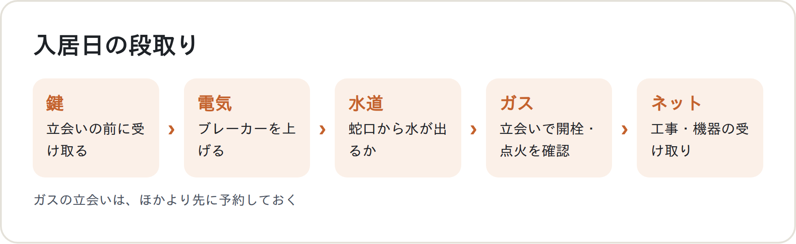
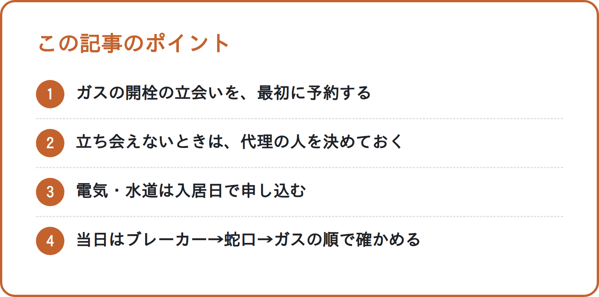

<!-- 状態：校正待ち（ライター：リク・10/2）／アカウント：A11／価格：無料
     制度確認：未（ジンの点検待ち）
     編集長・ジンへ：東京ガスの FAQ・公式ページは作業環境から開けず、WebSearch の検索結果の要約で確かめた（確認リストはすべて「原文未確認」）
     N013（手続き先）・N020（繁忙期の申し込み順）と重ならないよう、「入居日の当日に、何をどの順で確かめるか」に絞った。手続き先の調べ方は N013、申し込みの順番は N020 に任せている
     ガスの申し込みの目安の日数（入居の1〜2週間前など）・ネットの開通日数・料金は書いていない（日数は出典が FAQ の要約や民間サイトだけのため）
     締めの「でんき開通サポート」の説明は N013・N020 と同じ（lp/index.html の記載どおり）。LP の URL は【社長確認】を増やさないため入れていない -->

# 入居した日にお湯が出ない…を防ぐ：冬前の引越しで、ガス開栓の立会い・電気・水道・ネットを入居日にそろえる段取り

**こんな人向け：** 10〜12月に関東で引越す人。入居したその日から、お風呂と暖房を使いたい人。

**この記事で分かること：** 入居日の前にそろえておく予約。入居日の当日に、何をどの順で確かめるか。

**結論：** 入居日に一番合わせにくいのは、ガスの開栓の立会いです。ガスの予約を先に入れ、ほかは入居日の午前に順に確かめます。

---

## なぜ冬前は「入居日」が大事なのか

寒くなる時期は、お湯と暖房がないと困ります。入居した夜にシャワーが使えないと、つらいものです。

電気と水道は、立会いなしで使い始められることが多いです。ガスは、立会いが要るのが一般的です。

だから、入居日の段取りはガスを中心に組みます。

## 入居日の前に：予約をそろえる

### ガスの開栓：立会いの日時を押さえる

東京ガスは、ガスの使用開始（開栓）の作業には立会いをお願いしています。係の人が訪問して、メーターの栓を開け、点火を確かめます。

本人が立ち会えないときは、代理の人でもよいとされています。たとえば、大家さんや管理人さんです。

立会いの日時は、希望どおりに取れるとは限りません。新居が決まったら、**ほかの手続きより先に**予約を入れておきます。

東京ガス以外のガス会社や、プロパンの物件もあります。立会いの条件や予約のしかたは、**新居のガス会社の案内**で確かめてください。

### 電気：使用開始の申し込みを済ませる

電気は、入居日を「使用開始日」として申し込みます。スマートメーターの物件なら、立会いなしで使い始められることが多いです。

申し込みが済んでいないと、ブレーカーを上げても明かりがつかないことがあります。

### 水道：新居の水道局に申し込む

水道は、新居の地域の水道局に、使用開始を申し込みます。申し込み方法は、水道局ごとに違います。

### ネット：工事や機器の届く日を確かめる

ネットの開通日は、回線や建物によって違います。工事の立会いが要る場合もあります。

申し込んだら、開通日と、ルーターなど機器の届く日を確かめます。入居日に間に合わないときのつなぎも考えておきます。

### ウォーターサーバー：届く日は入居日以降に

ウォーターサーバーを使う人は、届く日を入居日以降にします。電源が要るので、置く場所のコンセントも見ておきます。

<!-- 画像：図解 -->

## 入居日の当日：この順で確かめる

### ① 鍵を受け取る

まず鍵を受け取ります。ガスの立会いの時間より前に、受け取れるようにしておきます。

### ② 電気：ブレーカーを上げる

分電盤のブレーカーを上げて、明かりがつくか確かめます。つかないときは、電気の契約先に連絡します。

### ③ 水道：蛇口から水が出るか見る

台所とお風呂の蛇口をひねって、水が出るか確かめます。出ないときは、水道局の案内を見て連絡します。

### ④ ガス：立会いで開栓してもらう

予約した時間に、係の人が来ます。開栓のあと、給湯器やコンロに火がつくか確かめてもらいます。

給湯器には、電気も使う機種があります。電気が先に使えると、その場でお湯まで確かめやすくなります。

### ⑤ ネット・ウォーターサーバー

ネットの工事や機器の受け取りがあれば、その時間に合わせます。ウォーターサーバーも、届く日にコンセントの近くに置きます。

<!-- 画像：ポイント -->

## この記事のポイント

- ガスの開栓の立会いを、最初に予約する
- 立ち会えないときは、代理の人を決めておく
- 電気・水道は入居日で申し込む
- 当日はブレーカー→蛇口→ガスの順で確かめる

## チェックリスト：入居日にそろえる

- [ ] 新居のガス会社に、開栓の立会いの日時を予約した
- [ ] 立ち会えないときの代理の人（大家さん・管理人さん）を決めた
- [ ] 鍵を受け取る時間を、立会いの前にした
- [ ] 電気の使用開始を、入居日で申し込んだ
- [ ] 水道の使用開始を、新居の水道局に申し込んだ
- [ ] ネットの開通日と、機器の届く日を確かめた
- [ ] ウォーターサーバーの届く日を、入居日以降にした
- [ ] 当日：ブレーカー → 蛇口 → ガスの立会い → ネットの順で確かめる

## よくある失敗

**1. ガスの予約を最後にして、立会いの日が取れない**

電気と水道を先に済ませて、ガスを後回しにする例です。ガスは立会いの日時が要るので、最初に予約します。

**2. 立会いの時間に、まだ鍵がない**

鍵を受け取る時間が、立会いのあとになっている例です。鍵の受け取りは、立会いより前にしておきます。

**3. 給湯器に電気が来ていない**

ガスは開いたのに、電気の申し込みがまだでお湯が出ない例です。電気の使用開始は、入居日で申し込んでおきます。

---

## 引越しのこと、まとめて相談できます

入居日にライフラインとネットをそろえたい方は、まるっと窓口（筆者の会社）へ。関東1都6県では「でんき開通サポート」があります。対象は東京・神奈川・埼玉・千葉・茨城・群馬・栃木です。

新居の電気の使用開始のお申し込みを取り次ぎます。ガス・水道・インターネットのお申し込みも、あわせてお預かりします。

電力会社・ガス会社・水道局の公式窓口ではなく、民間の取次サービスです。

ネット回線は、フレッツ光・ドコモ光・auひかり・ソフトバンク光などからご案内します。建物やエリアによって使えない回線があるため、新居で使える回線をお伝えします。

筆者の会社では、引越しにまつわる次のご相談をまとめて受けています。
- 電気・ガス・水道の手続き
- インターネット回線
- ウォーターサーバー
- お部屋探し（提携する不動産会社をご紹介します。物件のご案内・契約・仲介は提携先の不動産会社が行います【社長確認：提携先の不動産会社名と宅建業の免許番号】）
- 関東の引越し業者のご紹介

※紹介するサービスによって、当社が紹介料を受け取る場合があります。【社長確認：書き方】

▶ [引越しの無料相談フォーム](https://【社長確認：引越し相談フォームのURL】?src=N202)

---

## 確認リスト（公開前に消す）

**出典（すべて WebSearch の検索結果の要約で確認。公式ページの本文は作業環境から開けず＝原文未確認。ジンが原文で確かめる）**
- 東京ガス FAQ「ガスの使用開始（開栓）作業時に、立会いが必要か知りたい。」https://support.tokyo-gas.co.jp/faq/show/1870?category_id=900&site_domain=open ：開栓作業には立会いが必要【原文未確認】
- 東京ガス FAQ「ガスの使用開始（開栓）作業の立会者は、入居者本人以外でも可能か知りたい。」https://support.tokyo-gas.co.jp/faq/show/1874?category_id=924&site_domain=open ：お知らせを伝えられる代理の方（大家さま・管理人さまなど）の立会いでも可【原文未確認】
- 東京ガス「ガス・電気の使用開始お手続き詳細」https://home.tokyo-gas.co.jp/gas_power/procedure/moving/khsn_k_nagare.html ：係員が訪問し、メーターの栓を開く・宅内で点火の確認・安全のお願いの説明【原文未確認】
- 東京ガス FAQ 2件は、ジンが10/2に WebSearch の検索結果で再確認（立会いは必要・代理の方〈大家さま・管理人さまなど〉でも可）。公式ページはジンの環境からも開けず【原文未確認】
- 給湯器と電気：リンナイ FAQ「ガス給湯器｜電源が入らない場合の対応方法は？」https://faq.rinnai.co.jp/faq/show/1185?category_id=2&site_domain=default （ブレーカー・電源プラグの確認を案内）。言い過ぎを避け「電気も使う機種があります」に弱めた【原文未確認】
- 「電気はスマートメーターなら立会いなしで使用開始できることが多い」「水道の申し込み方法は水道局ごとに違う」は N013 と同じ書き方（N013 の確認リストの出典・lp/index.html のQ&A）【原文未確認】
- 使っていない話：開栓の申し込みは「入居の1〜2週間前まで」などの日数（FAQ の要約と民間サイトだけのため）。ネットの開通日数・料金

**ジンに確かめてほしいこと**
- [ ] 「給湯器は、電気も使う機種が多いです」は一般的な話として言い過ぎでないか（出典なし。言い過ぎなら削る）
- [ ] 「東京ガスは、開栓の作業には立会いをお願いしています」の言い方が FAQ の原文に合っているか

**【社長確認】**
- 提携先の不動産会社名と宅建業の免許番号
- 紹介料についての書き方
- 引越し相談フォームの URL

**点検（moving/review.md）**
- [x] ガス会社の決まりは公式の出典つき（原文未確認はジンが確認）
- [x] 「仲介手数料無料」は書いていない（この記事のテーマ外）
- [x] 物件の紹介は「提携する不動産会社をご紹介」、会社名・免許番号は【社長確認】
- [x] 他社の料金・キャンペーン・開通日数を書いていない
- [x] 締めあり（筆者の会社が紹介していること・紹介料を受け取る場合があること）
- [x] フォームのリンクに ?src=N202
- [x] ng-words なし。不安をあおっていない
- [x] チェックリストあり
- [ ] 制度確認：未（ジンの点検待ち）
- [x] 出典が1つだけの話（日数など）は使っていない
