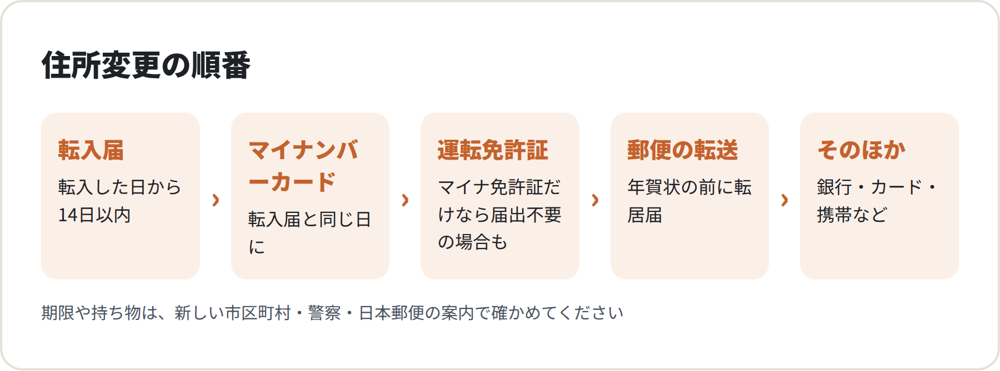
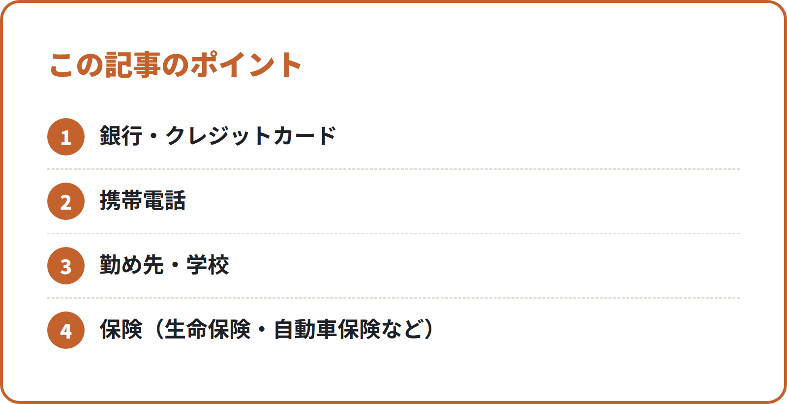

<!-- 状態：校正待ち（ライター：サヤ・10/2）／アカウント：A11／価格：無料
     制度確認：済（ジン・10/2）＋直した点：①マイナ免許証の事前の手続きを「免許センターなどで電子証明書を出し、マイナポータルで連携」と具体化し、事前の手続きをしていない人も警察への届出が要ると足した ②マイナンバーカードは「90日以内」を自治体の案内で再確認、転入届が遅れても失効することがある旨を足した。「カードの裏など」を「追記欄」に ③郵便の「今日のうちに出しておくと安心」を「早めに出しておきます」に（急がせる書き方を外した） ④40字を超える文を短くした。14日（住民基本台帳法）・1年間・3〜7営業日は公式の言い方どおり。宅建業法（提携先をご紹介・仲介は提携先）・紹介料の表示・相談フォームの ?src・ng-words は問題なし。【社長確認】は既存の3つのまま。公式ページはジンの環境からも開けず、WebSearch の検索結果で確認（原文未確認の出典は社長が公開前に確認）
     編集長・ジンへ：総務省・警察庁・日本郵便・自治体のページは作業環境から開けず、WebSearch の検索結果の要約で確かめた（確認リストはすべて「原文未確認」）
     N010（全体のチェックリスト）・N021（マイナポータルの転出届）と重ならないよう、「転入したあとの住所変更の順番」に絞った
     日数（転入届の14日・マイナンバーカードの90日・郵便の1年間と3〜7営業日）は、法律・公式の案内の言い方として「〜とされています」「案内しています」と書き、自治体・日本郵便のページで確かめるよう添えた
     「年賀状の前に転居届を」はリサーチでも推測扱いのため、時期の目安としてだけ書き、日付は書いていない -->

# 引越したあとの住所変更はこの順番で：転入届・マイナンバーカード・運転免許証（マイナ免許証）・郵便の転送（年賀状の前に）

**こんな人向け：** 10〜11月に関東で引越す人。年内に引越して、住所変更をまとめて片づけたい人。

**この記事で分かること：** 引越したあとの住所変更の順番と、郵便の転送を出す時期。マイナ免許証の人と、そうでない人の違い。

**結論：** 転入届とマイナンバーカードの住所変更は、同じ日に済ませます。次に運転免許証、郵便の転送の順です。

---

<!-- 画像：図解 -->

## なぜ順番が大事なのか

住所変更の多くは、新しい住所が分かる書類を求めます。その書類のもとになるのが、転入届です。

だから、まず役所の手続きを済ませます。そのあとで、ほかの住所変更を進めると手戻りが少なくなります。

## ① 転入届（新しい市区町村の役所で）

### 期限は「転入した日から14日以内」

別の市区町村から引越したら、新しい市区町村に転入届を出します。住民基本台帳法では、転入した日から14日以内とされています。

同じ市区町村の中での引越しは「転居届」です。こちらも、役所の窓口で手続きします。

### 持っていくもの

- 本人確認書類
- マイナンバーカード（持っている人。家族の分も）
- 転出証明書（旧住所の役所で受け取った人）

マイナポータルで転出届を出した人は、転出証明書が要らない場合があります。持ち物は、新しい市区町村のページで確かめてください。

## ② マイナンバーカードの住所変更（転入届と同じ日に）

マイナンバーカードを持っている人は、転入届と一緒に住所の変更をします。カードの追記欄に、新しい住所が書き込まれます。

自治体の案内では、転入届から90日以内の手続きが必要とされています。過ぎると、カードが使えなくなります。

転入届が遅れたときも、カードが使えなくなることがあります。転入届は、期限の14日以内に出します。

窓口で同じ日に済ませておけば、期限を気にせずに済みます。**転入届の日に、カードも一緒に出す**と覚えておきます。

暗証番号を聞かれることがあります。カードを受け取ったときの暗証番号の控えを、出かける前に探しておきます。

## ③ 運転免許証の住所変更

### マイナ免許証だけを持っている人

マイナ免許証だけの人は、警察への届出が要らない場合があります。警察庁の案内で、転入届だけで済む仕組みです。

ただし、事前の手続きが要ります。免許センターなどで電子証明書を出し、マイナポータルで連携します。

事前の手続きをしていない人は、警察への届出が要ります。従来の免許証との2枚持ちの人も、対象外です。

### それ以外の人

従来の免許証や2枚持ちの人は、警察署などで住所を変えます。事前の手続きをしていない人も同じです。

新しい住所が分かる書類（住民票の写しなど）が要ります。窓口や持ち物は、新しい住所の都県の警察のページで確かめてください。

## ④ 郵便の転送（年賀状の前に）

日本郵便に転居届を出すと、旧住所あての郵便が新しい住所に届きます。窓口・ポスト・Webの「e転居」で出せます。

日本郵便は、届け出た日から1年間転送すると案内しています。転送が始まるまでに、3〜7営業日ほどかかる（前後する場合がある）としています。

まだ出していない人は、早めに出しておきます。年末に引越す人は、年賀状のやりとりが始まる前に出します。

転送されているあいだに、送り主に新しい住所を伝えていきます。

## ⑤ そのほかの住所変更

<!-- 画像：ポイント -->

役所と郵便が済んだら、残りをまとめて進めます。

- 銀行・クレジットカード
- 携帯電話
- 勤め先・学校
- 保険（生命保険・自動車保険など）
- 通販サイト・定期便

## この記事のポイント

- 転入届は、転入した日から14日以内
- マイナンバーカードの住所変更は同じ日に
- マイナ免許証だけの人は、警察の届出が要らない場合がある
- 郵便の転送は、年賀状の前に出す

## チェックリスト：引越したあとの住所変更

- [ ] 転入届（または転居届）を出した
- [ ] 同じ日に、マイナンバーカードの住所を変えた（家族の分も）
- [ ] マイナンバーカードの暗証番号の控えを確かめた
- [ ] 自分の免許証がマイナ免許証だけか、2枚持ちかを確かめた
- [ ] 必要な人は、警察署などで免許証の住所を変えた
- [ ] 日本郵便に転居届を出した
- [ ] 銀行・カード・携帯・勤め先・保険の住所を変えた

## よくある失敗

**1. カードを持たずに転入届に行く**

転入届だけ出して、マイナンバーカードを持っていない例です。もう一度役所に行くことになるので、家族の分も持っていきます。

**2. 2枚持ちなのに、警察の手続きは要らないと思う**

マイナ免許証と従来の免許証を両方持つ例です。2枚持ちは対象外なので、警察署などで住所を変えます。

**3. 転居届を出すのが遅れる**

引越しの直前に出して、転送が間に合わない例です。登録には日数がかかるので、早めに出しておきます。

---

## 引越しのこと、まとめて相談できます

引越し業者選びに迷ったら、まるっと窓口（筆者の会社）にご相談ください。関東の引越し業者をご紹介しています。

筆者の会社では、引越しにまつわる次のご相談をまとめて受けています。
- 関東の引越し業者のご紹介
- お部屋探し（提携する不動産会社をご紹介します。物件のご案内・契約・仲介は提携先の不動産会社が行います【社長確認：提携先の不動産会社名と宅建業の免許番号】）
- 電気・ガス・水道の手続き
- インターネット回線
- ウォーターサーバー

※紹介するサービスによって、当社が紹介料を受け取る場合があります。【社長確認：書き方】

▶ [引越しの無料相談フォーム](https://【社長確認：引越し相談フォームのURL】?src=N203)

---

## 確認リスト（公開前に消す）

**出典（すべて WebSearch の検索結果の要約で確認。公式ページの本文は作業環境から開けず＝原文未確認。ジンが原文で確かめる）**
- 住民基本台帳法 第22条（転入した日から14日以内に届出）e-Gov 法令検索 https://laws.e-gov.go.jp/law/342AC0000000081 【原文未確認】
- 総務省「住所の異動届は正しく行われていますか？」https://www.soumu.go.jp/menu_kyotsuu/important/topics081127.html 【原文未確認】
- 横浜市「マイナンバーカードを利用した転入届（市外からの引越し）」https://www.city.yokohama.lg.jp/kurashi/koseki-zei-hoken/todokede/koseki-juminhyo/todokede-touroku/jyumin/tennyuu_shigai/card.html ／大田区「住所変更に伴うマイナンバーカードの手続きについて」https://www.city.ota.tokyo.jp/seikatsu/koseki_j/jyuminhyo/todokede/jyuusyo-henkou_mynumber-card.html ：転入届から90日以内に継続利用の手続きをしないと失効、暗証番号が必要【原文未確認】（90日は自治体の案内の要約だけ。総務省・デジタル庁の原文でも確かめる）
- マイナポータル「引越し関連手続一覧」https://myna.go.jp/html/moving_oss_procedure_list.html 【原文未確認】
- 警察庁「住所変更ワンストップサービス等の FAQ」https://www.npa.go.jp/bureau/traffic/FAQ05.pdf ／「マイナンバーカードと運転免許証の一体化」https://www.npa.go.jp/bureau/traffic/r4kaisei_main.html ：マイナ免許証のみの人は、事前の手続（署名用電子証明書の提出・連携）をしていれば転入届だけで警察への届出が不要、2枚持ちは対象外【原文未確認】
- 警視庁「記載事項変更（住所、氏名、本籍（国籍等）の変更の方）」https://www.keishicho.metro.tokyo.lg.jp/menkyo/koshin/kisai00.html ：従来の免許証の住所変更の窓口・持ち物【原文未確認】
- 日本郵便「転居・転送サービス」https://www.post.japanpost.jp/service/tenkyo/index.html ：窓口・ポスト・e転居で届出、届出日から1年間転送、登録まで3〜7営業日（前後する場合あり）【原文未確認】
- ジン10/2 再確認（WebSearch の検索結果。公式ページは開けず【原文未確認】）：杉並区・中央区・生駒市など自治体の案内で「転入届から90日以内に継続利用の手続きをしないと失効」「転入届が転入から14日・転出予定日から30日を過ぎると失効」。警察庁・埼玉県警の案内で、ワンストップは「マイナ免許証のみ」「事前に免許センター等で署名用電子証明書を提出」「自分でマイナポータル連携」の3条件、利用申請していない人・2枚持ちは警察への届出が必要
- 推測の扱い：「年賀状のやりとりが始まる前に出しておく」はリサーチでも推測。日付は書いていない

**ジンに確かめてほしいこと**
- [ ] マイナンバーカードの「90日以内」の書き方（自治体の案内の要約だけ）。総務省の原文で確かめ、違えば直す
- [ ] 「マイナポータルで転出届を出した人は、転出証明書が要らない場合があります」が N021・デジタル庁の言い方に合っているか
- [ ] 従来の免許証の住所変更で「住民票の写しなど」が持ち物として合っているか（都県の警察で違うか）

**【社長確認】**
- 提携先の不動産会社名と宅建業の免許番号
- 紹介料についての書き方
- 引越し相談フォームの URL

**点検（moving/review.md）**
- [x] 役所の手続き・期限・法律は公式の出典つき（原文未確認はジンが確認）
- [x] 「仲介手数料無料」は書いていない（この記事のテーマ外）
- [x] 物件の紹介は「提携する不動産会社をご紹介」、会社名・免許番号は【社長確認】
- [x] 他社の料金・キャンペーンを書いていない
- [x] 締めあり（筆者の会社が紹介していること・紹介料を受け取る場合があること）
- [x] フォームのリンクに ?src=N203
- [x] ng-words なし。不安をあおっていない
- [x] チェックリストあり
- [x] 制度確認：済（ジン・10/2）
- [x] 出典が1つだけの話は断定していない（90日・年賀状の時期）
