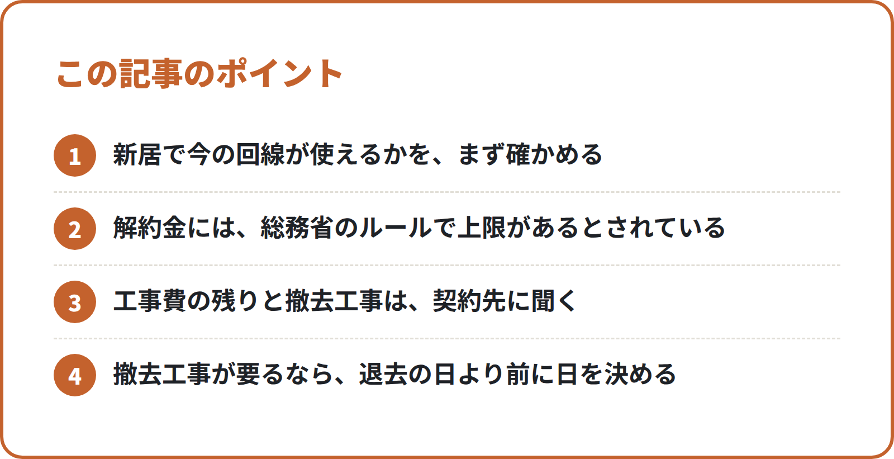

<!-- 状態：校正待ち（ライター：リク・10/3）／アカウント：A11／価格：無料
     制度確認：済（ジン・10/3）＋直した点：①解約金の上限は検索結果（総務省の資料・自治体の案内）で「期間拘束契約の解約金は月額料金相当額が上限・2022年7月1日施行」を確認。1文を40字以内に分けた ②施行より前の契約は、総務省の資料に「当分の間、上限の規定を適用しない」経過措置があるとされるため、「契約によります」を「当てはまらない場合があるとされています」に直した（言い切りはしない） ③工事費の残りは「期間に応じて減った残り」で Q&A の範囲に合う ④出典のない「今の回線は自動では止まらない」「引越しの日まで使うことが多い」を弱めた。撤去工事・機器の返却は「要ることがある」の一般論で金額・日数なしのため残した ⑤締めのでんき開通サポートに、N014・N020 と同じ「公式窓口ではなく民間の取次サービス」を足した。他社の料金・日数の断定なし、宅建業法（提携先をご紹介）・紹介料の表示・?src=N205・ng-words は問題なし。【社長確認】は既存の3つのまま。原文未確認の出典は社長が公開前に確認
     編集長・ジンへ：総務省のページは作業環境から開けず、出典はリサーチメモ（カナデ・10/3）の検索結果の要約だけ（確認リストはすべて「原文未確認」）
     解約金の上限・施行日は「とされています」と書き、言い切っていない。ルールの前からの契約に当てはまるかは「契約先に確かめる」とした（推測なので断定しない）
     各社の解約金・工事費・撤去費の金額、開通までの日数は書いていない。回線各社の公式ページ・契約書で確かめるよう案内した
     ウォーターサーバーは出典がないので、一般論の1段落だけ（今の契約先に引越しの手続きを確かめる）
     N014（新居の回線の申込）・N020（繁忙期の順番）・N202（入居日の段取り）と重ねず、「今の部屋（旧居）の回線をどうするか」に絞った
     締めは N201 と同じ形（提携する不動産会社をご紹介＋【社長確認】3種類だけ）。仲介手数料無料はこの記事のテーマ外なので書いていない
     画像（見出し・ポイント図など）は入れていない（センター長が tools/build_note_images.py で作る） -->

# 今の部屋のネット回線は「移転」か「解約」か：引越しの前に確かめる解約金の上限ルール・工事費の残り・撤去工事

**こんな人向け：** 10〜12月に関東で引越す人。今の部屋で光回線などを使っている人。

**この記事で分かること：** 今の回線を「移転」するか「解約」するかの決め方。解約の前に、契約先に聞くこと。

**結論：** まず、新居で今の回線が使えるかを確かめます。解約するなら、解約金・工事費の残り・撤去工事の3つを先に聞きます。

---

## なぜ「今の部屋の回線」を先に考えるのか

引越しでは、新居の回線に目が向きがちです。でも、今の部屋の回線も片づける必要があります。

移転か解約かで、手続きもお金も変わります。決めてから動くと、二度手間が少なくなります。

## 1. 「移転」か「解約」かを決める

### 移転：同じ契約先で新居に移す

今の回線会社のまま、新居で使い続ける方法です。新居で同じ回線が使えることが前提になります。

建物やエリアによって、使えない回線があります。新居の住所で使えるかを、契約先に確かめます。

### 解約：今の回線をやめる

新居で使えないときや、別の回線にしたいときの方法です。新居の回線は、別に申し込みます。

解約するときは、お金がかかるかを先に確かめます。次の章の3つです。

### 決めるときに見ること

- 新居の住所で、今の回線が使えるか
- 移転の手続きと、新居での工事が要るか
- 解約したとき、どんなお金がかかるか
- 新居の建物に、入っている回線があるか

## 2. 解約の前に確かめる3つのこと

### ① 解約金（期間の決まりがある契約）

「2年契約」など、期間の決まりがある契約があります。期間の途中でやめると、解約金がかかることがあります。

総務省の消費者保護ルールに、解約金の上限があるとされています。
2022年7月からで、月額料金に当たる額が上限、という内容です。

それより前からの契約には、当てはまらない場合があるとされています。自分の解約金がいくらかは、契約先に確かめます。

### ② 工事費の残り

始めたときの工事費を、毎月分けて払っていることがあります。途中でやめると、残りを請求される場合があります。

総務省のQ&Aでも、期間に応じて減った残りを請求される場合があるとされています。残りがいくらかは、契約先に聞きます。

### ③ 撤去工事と、機器の返却

回線によっては、やめるときに撤去の工事が要ることがあります。立会いが要るかも、あわせて聞いておきます。

ルーターなどの機器を、借りていることもあります。返し方と、返す期限を確かめます。

## 3. 解約の日の決め方

今の部屋の回線を、いつまで使うかを決めます。新居の回線が使えるようになる日も、見ておきます。

撤去工事が要るときは、退去の日より前に日を決めます。解約の日は、契約先と相談して決めます。

## 4. ウォーターサーバーも、今の契約を確かめる

ウォーターサーバーを使っている人は、今の契約先に聞きます。引越しのときの手続きは、会社や契約で違います。

<!-- 画像：ポイント -->

## この記事のポイント

- 新居で今の回線が使えるかを、まず確かめる
- 解約金には、総務省のルールで上限があるとされている
- 工事費の残りと撤去工事は、契約先に聞く
- 撤去工事が要るなら、退去の日より前に日を決める

## チェックリスト：今の部屋の回線

- [ ] 今の回線の契約先と、契約の内容を確かめた
- [ ] 新居の住所で、今の回線が使えるか聞いた
- [ ] 移転か解約かを決めた
- [ ] 解約金がかかるか、いくらかを聞いた
- [ ] 工事費の残りがあるか、いくらかを聞いた
- [ ] 撤去工事が要るか、立会いが要るかを聞いた
- [ ] 借りている機器の返し方と期限を確かめた
- [ ] ウォーターサーバーの引越しの手続きを確かめた

## よくある失敗

**1. 新居の回線だけ申し込んで、今の回線を忘れる**

新居の準備に気をとられる例です。今の回線をどうするかも、自分で契約先に伝えます。

**2. 工事費の残りを知らずに解約する**

解約金だけを見て、工事費の残りを見落とす例です。解約の前に、両方の金額を契約先に聞きます。

**3. 撤去工事の日が、退去に間に合わない**

撤去工事が要ると、あとで知る例です。解約を伝えるときに、工事が要るかを一緒に聞きます。

---

## 引越しのこと、まとめて相談できます

新居の回線選びに迷ったら、まるっと窓口（筆者の会社）にご相談ください。フレッツ光・ドコモ光・auひかり・ソフトバンク光などからご案内します。

建物やエリアによって、使えない回線があります。新居で使える回線をお伝えします。

関東1都6県では「でんき開通サポート」もあります。新居の電気の使用開始のお申し込みを取り次ぎます。
電力会社などの公式窓口ではなく、民間の取次サービスです。

お部屋探しは、提携する不動産会社をご紹介します（物件のご案内・契約・仲介は提携先の不動産会社が行います）【社長確認：提携先の不動産会社名と宅建業の免許番号】

筆者の会社では、引越しにまつわる次のご相談をまとめて受けています。
- インターネット回線（新居で使える回線をご案内）
- ウォーターサーバー
- 電気・ガス・水道の手続き
- お部屋探し（提携する不動産会社をご紹介）
- 関東の引越し業者のご紹介

※紹介するサービスによって、当社が紹介料を受け取る場合があります。【社長確認：書き方】

▶ [引越しの無料相談フォーム](https://【社長確認：引越し相談フォームのURL】?src=N205)

---

## 確認リスト（公開前に消す）

**出典（すべてリサーチメモ・10/3 の検索結果の要約。公式ページの本文は作業環境から開けず＝原文未確認。ジンが原文で確かめる）**
- 総務省 電気通信消費者情報コーナー「消費者保護ルール」https://www.soumu.go.jp/main_sosiki/joho_tsusin/d_syohi/shohi.htm ：2022年7月1日施行、期間拘束の解約金は月額料金相当額が上限、遅滞なく解約できる措置の義務化【原文未確認】
- 総務省「改正電気通信事業法施行規則に関するQ&A（令和4年7月1日最終改正）」https://www.soumu.go.jp/main_content/000824364.pdf ：工事費は契約期間に応じて減った残りを請求される場合がある【原文未確認】
- 推測の扱い：上限ルールが施行日より前の契約に当てはまらない場合があるか（リサーチでも推測）。本文では「契約によります。契約先に確かめます」とだけ書いた
- ジンの確認（10/3・WebSearch の検索結果。総務省のページはジンの環境からも開けず）：総務省資料「消費者保護ルールの現状と課題（令和5年11月）」https://www.soumu.go.jp/main_content/000914681.pdf ・同「電気通信事業法第27条の3の施行状況の検討（2022年10月）」https://www.soumu.go.jp/main_content/000842225.pdf の要約で、上限は「一月当たりの料金に相当する額」、2022年7月1日時点の既往契約（その更新を含む）には当分の間適用しない経過措置、と確認【原文未確認】
- 出典なし（一般論）：撤去工事・機器の返却が要る場合がある／ウォーターサーバーの引越し手続きは会社や契約で違う。金額・日数は書いていない

**ジンに確かめてほしいこと**
- [ ] 「2022年7月から解約金に上限」「月額料金に当たる額が上限」が総務省の原文の言い回し・対象（光回線を含むか）に合っているか
- [ ] 「ルールの前からの契約に当てはまるかは、契約によります」で言い過ぎ・言い足りなくないか（原文に経過措置の記載があれば、その言い方に直す）
- [ ] 工事費の残りの書き方が Q&A の範囲に合っているか
- [ ] 撤去工事・機器の返却の一般論が、出典なしで書いてよい範囲か

**【社長確認】**
- 提携先の不動産会社名と宅建業の免許番号
- 紹介料についての書き方
- 引越し相談フォームの URL

**点検（moving/review.md）**
- [x] 法律・ルールは公式の出典つき（原文未確認はジンが確認・上限は断定していない）
- [x] 「仲介手数料無料」は書いていない（この記事のテーマ外）
- [x] 物件の紹介は「提携する不動産会社をご紹介」、会社名・免許番号は【社長確認】
- [x] 他社の料金・キャンペーンを書いていない（解約金・工事費・撤去費の金額なし）
- [x] 締めあり（筆者の会社が紹介していること・紹介料を受け取る場合があること）
- [x] フォームのリンクに ?src=N205
- [x] ng-words なし。不安をあおっていない
- [x] チェックリストあり
- [x] 制度確認：済（ジン・10/3）
- [x] 出典が1つだけの話は断定していない（施行前の契約の扱い）
- [ ] 画像・ハッシュタグ（センター長が作る）
